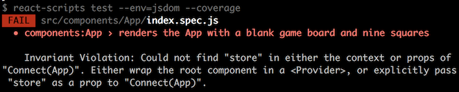
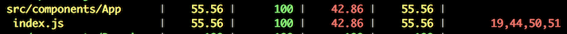
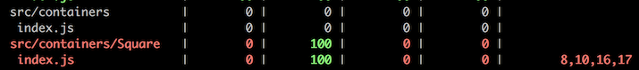
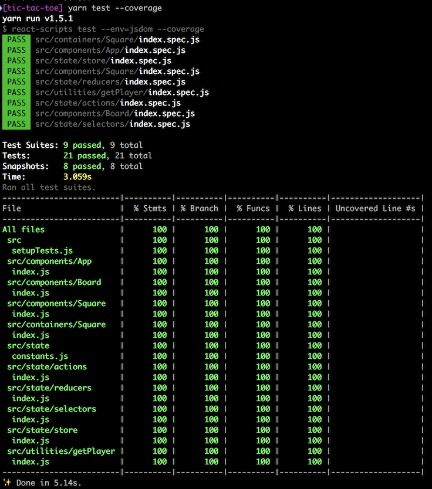
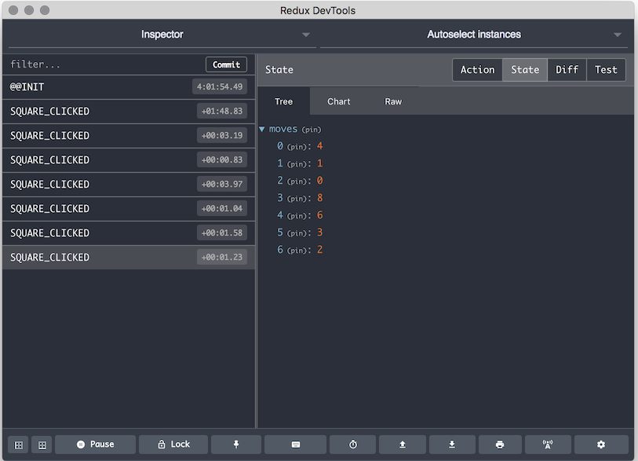

# Adding state management with Redux

We now have click handlers on our Squares, but all they do is log out the number of the Square to the dev console. That's not much use.

What we want is to track the players' moves in a `moves` array. We need somewhere to store that. We could store it in the internal state of the `App` component&mdash;and that's how most developers would probably do it initially&mdash;but, really, we will find it much easier in the long run to store all our state in one place, not distributed throughout the app.

A great way to do this is with the [redux](https://redux.js.org/) library.

Let's build a store in which we can keep our `moves` array. Then we'll pass that store into our `App` component (using React's [context](https://reactjs.org/docs/context.html) feature). In our `App` component we'll add a "selector" that gets the current state of our `moves` array, and a method that "dispatches" an action to the store that will append a move onto the `moves` array. It may seem complex, but it's actually very simple.

To begin, we'll create an action that represents a player's move. We're going to use a JavaScript Object with a `type` key and a `payload` key, and in the payload we'll include the square that the player is playing. Here is what our 'SQUARE_CLICKED' action is going to look like:

```javascript
{
  type: 'SQUARE_CLICKED',
  payload: {
    square: 4
  }
}
```

This is the current practice for Redux actions: a `type`, a `payload`, and, if necessary, a `meta` key.

We'll have a very limited, _enumerated_ set of action types, so let's create constants for the type names. First, let's create a folder to hold our state management code under the `src` folder and call it `src/state`. Then in there, let's create a `src/state/constants.js` file and a `src/state/index.js` file. Add the following to the `constants.js` file:

```javascript
// src/state/constants.js
export const SQUARE_CLICKED = 'SQUARE_CLICKED'
```

Pretty simple file, eh? Now we'll do our regular import/export in the `src/state/index.js` file:

```javascript
// src/state/index.js
import { SQUARE_CLICKED } from './constants'

export { SQUARE_CLICKED }
```

And we'll add this file to our list of files the coverage tool should ignore in `package.json`:

```json
"collectCoverageFrom": [
  "!src/registerServiceWorker.js",
  "!src/index.js",
  "!src/components/index.js",
  "!src/state/index.js",
  "!src/utilities/index.js",
  "src/**/*.{js,jsx}",
  "!<rootDir>/node_modules/"
],
```

Now we can use that action type to create our action. We're going to make an action creator function for our `squareClicked` action. Create a new folder under `src/state` at `src/state/actions` and an `index.spec.js` file in that folder. Now we'll add our test:

```javascript
// src/state/actions/index.spec.js
import { squareClicked } from '.'
import { SQUARE_CLICKED } from '..'

describe('state:actions', () => {
  describe('squareClicked', () => {
    it('produces the correct action for clicking a Square', () => {
      const square = 4

      expect(squareClicked(square)).toMatchObject({
        type: SQUARE_CLICKED,
        payload: {
          square: 4
        }
      })
    })
  })
})
```

Run the tests (use `p` and `actions` to filter on the actions folder) and you should see it fail. Now let's make it pass. Create a `src/state/actions/index.js` file with the following code:

```javascript
// src/state/actions/index.js
import { SQUARE_CLICKED } from '..'

function squareClicked (square) {
  return {
    type: SQUARE_CLICKED,
    payload: {
      square
    }
  }
}

export { squareClicked }
```

By now it should be obvious how this works. And the test should be passing. Let's add that to our `src/state/index.js` file:

```javascript
// src/state/index.js
import { squareClicked } from './actions'
import { SQUARE_CLICKED } from './constants'

export { SQUARE_CLICKED, squareClicked }
```
  
We have a working action creator! Let's commit to it:

```bash
git add -A
git commit -m "Add squareClicked action creator"
git push
```

-----

## The reducer

Next we need a function that will accept that action and our current state object and return a new state with that square added to the `moves` array. For this purpose, we'll use a Redux "reducer" function. Reducers are simple: they take an action and a state, and return a new state. Hey! Just what we were looking for.

So create a `src/state/reducers` folder, and an `index.spec.js` file in it. And then write this test:

```javascript
// src/state/reducers/index.spec.js
import { rootReducer } from '.'

describe('state:reducers', () => {
  describe('rootReducer', () => {
    it('handles an unknown action type by returning the state unchanged', () => {
      const state = 'state'

      expect(rootReducer(state, {})).toBe(state)
    })
  })
})
```

You may have noticed that the tests in watch mode only run on files chagned since the last commit, so we don't really need to filter them. Run the tests with `yarn test` and you should see the reducers test fail. Now we need to make it pass. So create a `src/state/reducers/index.js` file and add the following:

```javascript
// src/state/reducers/index.js
function rootReducer (state, action) {
  switch (action && action.type) {
    default:
      return state
  }
}

export { rootReducer }
```

Ha, ha. This couldn't be much simpler! It takes a state and an action, switches on the action.type (if it exists), and then does only one default action: returns the state unchanged. Not much use, but enough to pass our simple test. That's one of our requirements handled. Now let's address the other: we want to add squares to the moves array. Leave the tests running while we add more.

Let's create a new test first. Here's our updated `src/state/reducers/index.spec.js`:

```javascript
// src/state/reducers/index.spec.js
import { rootReducer } from '.'
import { squareClicked } from '..'

describe('state:reducer', () => {
  describe('rootReducer', () => {
    it('handles an unknown action type by returning the state unchanged', () => {
      const state = 'state'

      expect(rootReducer(state, {})).toBe(state)
    })

    it('handles a move by appending the Square number to the moves array', () => {
      const state = {
        moves: [4, 0]
      }

      expect(rootReducer(state, squareClicked(2))).toMatchObject({
        moves: [4, 0, 2]
      })
    })
  })
})
```

That's going to fail something like this:


As you can see, it did what we'd expect: returned the state unchanged. So let's fix that. Here is our new `src/state/reducers/index.js` file:

```javascript
// src/state/reducers/index.js
import { isUndefined } from 'ramda-adjunct'

import { SQUARE_CLICKED } from '..'

const initialState = { moves: [] }

function rootReducer (state = initialState, { payload = {}, type }) {
  switch (type) {
    case SQUARE_CLICKED:
      return {
        ...state,
        moves: isUndefined(payload.square)
          ? state.moves
          : [...state.moves, payload.square]
      }
    default:
      return state
  }
}

export { initialState, rootReducer }
```

Here we:

* Import `isUndefined` from 'ramda-adjunct'
* Create an initial state that holds an empty `moves` array
* Default the state parameter to the `initialState`
* Destructure the `action` parameter into a payload (defaults to an empty object) and a type
* Handle a SQUARE_CLICKED action type by creating a new state and
  * Copying over the old state: `...state` (this uses the new [spread operator](https://developer.mozilla.org/en-US/docs/Web/JavaScript/Reference/Operators/Spread_syntax))
  * Overwriting the `moves` array
    * If the `payload.square` is undefined, then just keeping the same `moves`
    * If the `payload.square` _is_ defined, then appending it to the `moves` array and returning that

Our test passes with flying colours, so we now have a `moves` array in state that updates.

Now let's update `src/state/index.js`:

```javascript
// src/state/index.js
import { squareClicked } from './actions'
import { SQUARE_CLICKED } from './constants'
import { initialState, rootReducer } from './reducers'

export { initialState, rootReducer, SQUARE_CLICKED, squareClicked }
```

See the pattern emerging?

So let's run our coverage tests again just for fun: `yarn test --coverage`. Here's what we should see:


Pay no attention to the App line&mdash;we'll fix that later (it's because we're not finished there). But what's going on with our reducer? We have two uncovered lines: 7 and 12.

Here is line 7:

```javascript
function rootReducer (state = initialState, { payload = {}, type }) {
```

We've tested the reducer with and without a payload, so that can't be it. But have we tested that the state defaults to the `initialState`? No, we haven't. So let's add a test for that. We'll need to import the initialState, too. Here's our updated `src/state/reducers/index.spec.js`:

```javascript
// src/state/reducers/index.spec.js
import { initialState, rootReducer } from '.'
import { squareClicked } from '..'

describe('state:reducers', () => {
  describe('rootReducer', () => {
    it('defaults to the initialState', () => {
      expect(rootReducer(undefined, {})).toBe(initialState)
    })

    it('handles an unknown action type by returning the state unchanged', () => {
      const state = 'state'

      expect(rootReducer(state, {})).toBe(state)
    })

    it('handles a move by appending the Square number to the moves array', () => {
      const state = {
        moves: [4, 0]
      }

      expect(rootReducer(state, squareClicked(2))).toMatchObject({
        moves: [4, 0, 2]
      })
    })
  })
})
```

Run our coverage check and line 7 has been handled. Now for line 12. It looks like this:

```javascript
moves: isUndefined(payload.square)
  ? state.moves
  : [...state.moves, payload.square]
```

We need to add a test that passes the action, but without a square. Here's our new `src/state/reducers/index.spec.js` file. The new test is at the bottom:

```javascript
// src/state/reducers/index.spec.js
import { initialState, rootReducer } from '.'
import { squareClicked } from '..'

describe('state:reducers', () => {
  describe('rootReducer', () => {
    it('defaults to the initialState', () => {
      expect(rootReducer(undefined, {})).toBe(initialState)
    })

    it('handles an unknown action type by returning the state unchanged', () => {
      const state = 'state'

      expect(rootReducer(state, {})).toBe(state)
    })

    it('handles a move by appending the Square number to the moves array', () => {
      const state = {
        moves: [4, 0]
      }

      expect(rootReducer(state, squareClicked(2))).toMatchObject({
        moves: [4, 0, 2]
      })
    })

    it('returns the state unchanged when the square is not supplied', () => {
      const state = {
        moves: [4, 0]
      }

      expect(rootReducer(state, squareClicked())).toMatchObject({
        moves: [4, 0]
      })
    })
  })
})
```

Run the coverage again and the reducer is at 100% coverage.

OK, time for another commit:

```bash
git add -A
git commit -m "Add rootReducer to handle squareClicked actions"
git push
```

-----

## Getting our moves out of the state

We also want to be able to retrieve our moves array from the state. We'll make a "selector" to do this. This selector will be absurdly simple, but as our app grows, our selectors will grow more complex, and it will become evident why they are useful.

Create a `src/state/selectors` folder and a `src/state/selectors/index.spec.js` file in it. Then add our test to the `index.spec.js` file:

```javascript
// src/state/selectors/index.spec.js
import { getMoves } from '.'

describe('state:selectors', () => {
  describe('getMoves', () => {
    it('extracts the moves array from the state', () => {
      const moves = [4, 0, 2]
      const state = { moves }

      expect(getMoves(state)).toBe(moves)
    })
  })
})
```

This fails the test. Now let's add the code in `src/state/selectors/index.js` to make it pass:

```javascript
// src/state/selectors/index.js
export function getMoves ({ moves }) {
  return moves
}
```

Finally, let's update our `src/state/index.js` file to import and export our selectors:

```javascript
// src/state/index.js
import { squareClicked } from './actions'
import { SQUARE_CLICKED } from './constants'
import { initialState, rootReducer } from './reducers'
import { getMoves } from './selectors'

export { getMoves, initialState, rootReducer, SQUARE_CLICKED, squareClicked }
```

Tough one, eh? And the tests pass and coverage is 100%. Let's commit!

```bash
git add -A
git commit -m "Add getMoves selector"
git push
```

-----

Next, we'll need a store to put our state in, dispatch our actions to our reducer, and notify our components when the state is updated. That's what Redux gives us.

## Adding the store

Add the folder, `src/state/store`, and the default file, `src/state/store/index.spec.js`. 

Our Redux store will wrap up our state and provide three methods for manipulating state:

* `getState` to retrieve the latest state from the store
* `dispatch` to dispatch actions to the reducer, thus updating the state
* `subscribe` to allow components to listen for updates to the state so they know when to re-render

On the basis of this, we can write our test:

```javascript
// src/state/store/index.spec.js
import configureStore from '.'

describe('state:store', () => {
  describe('configureStore', () => {
    it('creates a store', () => {
      expect(configureStore()).toHaveProperty('getState')
      expect(configureStore()).toHaveProperty('dispatch')
      expect(configureStore()).toHaveProperty('subscribe')
    })
  })
})
```

That fails, of course. Next, we'll create our store to make the test pass. In `src/state/store/index.js`, put:

```javascript
// src/state/store/index.js
import { createStore } from 'redux'

import { rootReducer } from '..'

export default function configureStore () {
  return createStore(rootReducer)
}
```

And we'll add our store to our imports and exports in the `src/state/index.js` file, of course:

```javascript
// src/state/index.js
import { squareClicked } from './actions'
import { SQUARE_CLICKED } from './constants'
import { initialState, rootReducer } from './reducers'
import { getMoves } from './selectors'
import configureStore from './store'

export {
  configureStore,
  getMoves,
  initialState,
  rootReducer,
  SQUARE_CLICKED,
  squareClicked
}
```

After checking that test coverage is 100%. We're good to go:

```bash
git add -A
git commit -m "Add the store"
git push
```

-----

## Connecting our components

Now that we've got the state management ready to go&mdash;we have a `squareClicked` action, a `rootReducer` to update the state, a `getMoves` selector to extract the `moves` array from the state, and a `store` to roll it all up into one, we need to pass the store to our components. Rather than pass it in as a prop and then pass it down the component tree, we'll use the React Context to put it into the "context" where it can be extracted at any point in the hierarchy. And we'll use `react-redux` and some [higher-order components](https://reactjs.org/docs/higher-order-components.html) to simplify it all.

First we need to import our store into the context. We'll use a `react-redux` provided higher-order component (HOC) called [Provider](https://github.com/reactjs/redux/blob/master/docs/basics/UsageWithReact.md#passing-the-store) to wrap our `App` component and inject the store.

Open the `src/index.js` file and make it look like this:

```javascript
// src/index.js
import React from 'react'
import { render } from 'react-dom'
import { Provider } from 'react-redux'

import { App } from './components'
import { configureStore } from './state'
import registerServiceWorker from './registerServiceWorker'

const store = configureStore()

render(
  <Provider store={store}>
    <App />
  </Provider>,
  document.getElementById('root')
)
registerServiceWorker()
```

We:

* Import the `<Provider>` higher-order component from `react-redux`
* Import our `configureStore` function from our `state` folder
* Use `configureStore` to create our store
* Wrap the `<App />` component in our `<Provider>` and inject the store

The `<Provider>` does the rest. We can now access the store in our components by `connect`-ing them.

Now we will connect our `App` component to the store. Here's what our `src/components/App/index.js` file currently looks like:

```javascript
// src/components/App/index.js
import React from 'react'
import styled from 'styled-components'
import { times } from 'ramda'
import { isUndefined } from 'ramda-adjunct'

import { Board, Square } from '..'
import { getPlayer } from '../../utilities'

function makeSquares (moves) {
  return times(square => {
    const player = getPlayer(square, moves)

    return isUndefined(player) ? (
      <Square
        key={square}
        index={square}
        handleClick={() => console.log(`Square ${square}`)}
      />
    ) : (
      <Square key={square} index={square} player={player} />
    )
  }, 9)
}

const StyledApp = styled.div`
  display: grid;
  font-family: 'Verdana', sans-serif;
  grid-template-areas: 'board';
  height: 100vh;
  margin: 0;
  padding: 0;
  width: 100vw;
`
StyledApp.defaultName = 'StyledApp'

export default function App ({ moves = [] }) {
  return (
    <StyledApp>
      <Board>{makeSquares(moves)}</Board>
    </StyledApp>
  )
}
```

We're going to use `react-redux` and its [connect](https://github.com/reactjs/redux/blob/master/docs/basics/UsageWithReact.md#implementing-container-components) function to "connect" our `App` to our store. So first let's import it:

```javascript
import { connect } from 'react-redux'
```

We're going to want to get our `moves` array out of the state. We created the `getMoves` selector for precisely this purpose. We're also going to want to dispatch `SQUARE_CLICKED` actions to our reducer, which is why we created the `squareClicked` action creator. So we need to import both:

```javascript
import { getMoves, squareClicked } from '../../state'
```

We'll also create two functions that we'll use with `connect` to map the `moves` array from our state to our props, and to map our `dispatch` method to a function that will use our `squareClicked` action creator and `dispatch` to update the state&mdash;a function we'll inject into our `App` component as a prop as well.

To do this we create two functions. The first, intended to map the state to various props, we'll call `mapStateToProps`. You can call it whatever you want, but this is the convention. Here is our version:

```javascript
function mapStateToProps (state) {
  return {
    moves: getMoves(state)
  }
}
```

As you can see, it simply takes the state (passed to it by the `connect` method) and extracts the `moves` array, which it returns as a `moves` prop. The `connect` method will inject this prop into our `App` for us. It will also `subscribe` our component to the store so that it rerenders whenever the state is updated. Nice!

Then we'll create a function, call it `mapDispatchToProps` to inject a `markSquare` prop. `markSquare` will be a function that takes the index of the Square, uses the `squareClicked` action creator to create our `SQUARE_CLICKED` action, and the dispatches it to the store to update the state. From within `App` we'll be able to call `props.markSquare` and pass it the Square index to add it to our `moves` array. Wait until you see this in action!

Here is our `mapDispatchToProps` function:

```javascript
function mapDispatchToProps (dispatch) {
  return {
    markSquare: square => dispatch(squareClicked(square))
  }
}
```

Again, it's pretty simple! The `connect` function will pass the store's `dispatch` method to our `mapDispatchToProps` function, and our function will return a `markSquare` prop that can be called with the number of the Square (0 to 8) to dispatch a `SQUARE_CLICKED` action to the store with the number of the Square in the payload.

Now we need to connect these to our `App`, and we'll make this connected version (called a "container") our default export:

```javascript
export default connect(mapStateToProps, mapDispatchToProps)(App)
```

Note that connect is called first with our two mapper functions, and that returns a new function that we call with our component to wrap it.

We've made our `App` container the new default export, so we'll change the unwrapped `App` component just a named export. We'll also grab both of our injected props and we'll pass them along to the `makeSquares` function:

```javascript
export function App ({ markSquare, moves }) {
  return (
    <StyledApp>
      <Board>{makeSquares(markSquare, moves)}</Board>
    </StyledApp>
  )
}
```

As you can see, wrapping our `App` with the `connect` method is fairly simple. We can use a `mapStateToProps` function to pull things out of our state and inject them as props, and we can use a `mapDispatchToProps` function to provide functions as props that will permit our `App` component to update the state. This turns our "component" into a "container" for state.

Now we have to make use of these new props. We already wired up our `moves` array, but we need to use `markSquare` as our new click handler. Let's make our `makeSquares` function look like this:

```javascript
function makeSquares (markSquare, moves = []) {
  return times(square => {
    const player = getPlayer(square, moves)

    return isUndefined(player)
      ? <Square
        key={square}
        index={square}
        handleClick={() => markSquare(square)}
        />
      : <Square key={square} index={square} player={player} />
  }, 9)
}
```

We take the `markSquare` function and create a click handler for each Square that calls it with the number of the Square. This is not the most efficient way to do this, performance-wise, because each time our board is re-rendered, it will recreate these handler functions. But with only nine squares, this is a minor hit. Still, it might be worth refactoring to move the handlers further down in the mix, or to create them only once when the component is first loaded.

Now our `src/components/App/index.js` file should look like this:

```javascript
//src/components/App/index.js
import React from 'react'
import styled from 'styled-components'
import { times } from 'ramda'
import { isUndefined } from 'ramda-adjunct'
import { connect } from 'react-redux'

import { Board, Square } from '..'
import { getMoves, squareClicked } from '../../state'
import { getPlayer } from '../../utilities'

function makeSquares (markSquare, moves = []) {
  return times(square => {
    const player = getPlayer(square, moves)

    return isUndefined(player)
      ? <Square
        key={square}
        index={square}
        handleClick={() => markSquare(square)}
        />
      : <Square key={square} index={square} player={player} />
  }, 9)
}

const StyledApp = styled.div`
  display: grid;
  font-family: 'Verdana', sans-serif;
  grid-template-areas: 'board';
  height: 100vh;
  margin: 0;
  padding: 0;
  width: 100vw;
`
StyledApp.defaultName = 'StyledApp'

export function App ({ markSquare, moves }) {
  return (
    <StyledApp>
      <Board>{makeSquares(markSquare, moves)}</Board>
    </StyledApp>
  )
}

function mapStateToProps (state) {
  return {
    moves: getMoves(state)
  }
}

function mapDispatchToProps (dispatch) {
  return {
    markSquare: square => dispatch(squareClicked(square))
  }
}

export default connect(mapStateToProps, mapDispatchToProps)(App)
```

When we try to run our tests, however, we get an error that looks like this:



Why this error? It's because we changed our default export to the _containerised_ version of our App. The tests are trying to run this version, but without injecting a store, mock or otherwise. That's just not going to work.

There is a lot of discussion about what to test when working with containers. We could mock up a store and test the containerised version. Or we could just test our mapper functions, snapshot test the component, and let it go at that. We'll do that here to keep things simple, but if you want to mock the store and test the container, check out [redux-mock-store](http://arnaudbenard.com/redux-mock-store/).

Now let's change our `src/components/App/index.spec.js` file to import our component `App`, as well as our various functions, instead of the container `App`:

```javascript
import App from '.'
```

Now if we run our coverage tests (`yarn test --coverage`), we get no errors, but we find that our `App` test suite is missing quite a few tests:



We'll hold off on updating those tests until we're sure this is what we want. For now, let's run `yarn start` and test it in the browser. Then try clicking on various squares. You should see the following:

* The first square you click on gets a red X
* Clicking on it again does nothing (the cursor is no longer a pointer, either)
* The next square you click on gets a green O
* Play alternates between X and O
* Play can continue until all squares are full _even if a player won one or more moves ago_

We'll that's pretty good for now. But what's really happening on each click? There are tools to help us find out. We'll use Chrome's [React Developer Tools](https://chrome.google.com/webstore/detail/react-developer-tools/fmkadmapgofadopljbjfkapdkoienihi) extension. Once installed, we can open the Developer's console and click on the "React" tab. Then reload the page. This tab shows us the hierarchy of our React components and is worth a class or two in its own right.

At the top of the React Developer Tools pane you should see a "highlight updates" checkbox. Make sure it's checked:


Now click on a few squares and watch what happens. See how the board outlines in blue, including _each individual square?_ That tells us that on every click, _the entire board and all squares are re-rendering. That's going to make things slow. Really, we only want the square we've clicked to update, right? So how are we going to make that work?


To fix this, we'll need to move the point where we tap into the props down in the component hierarchy. Let's move it to where it belongs&mdash;in the Square.

Let's begin by stripping the `App` down to the bare minimum. We'll just have it return nine squares, each with an `index` set to the square number (0, 1, 2, etc.). We don't need to import `connect` or our action creator or our selector or our `getPlayer` utility function: we'll do all that in the individual square.

Here is what `src/components/App/index.js` should look like now:

```javascript
// src/components/App/index.js
import React from 'react'
import styled from 'styled-components'
import { times } from 'ramda'

import { Board, Square } from '..'

const StyledApp = styled.div`
  display: grid;
  font-family: 'Verdana', sans-serif;
  grid-template-areas: 'board';
  height: 100vh;
  margin: 0;
  padding: 0;
  width: 100vw;
`
StyledApp.defaultName = 'StyledApp'

export default function App () {
  return (
    <StyledApp>
      <Board>
        {times(square => <Square key={square} index={square} />, 9)}
      </Board>
    </StyledApp>
  )
}
```

So much simpler! We'll also need to change our `src/components/App/index.spec.js` file to import the default export. And we only need one snapshot as the `App` will never rerender! Here is the simplified code:

```javascript
// src/components/App/index.spec.js
import React from 'react'
import { shallow } from 'enzyme'

import App from '.'

describe('components:App', () => {
  it('renders the App with a blank game board and nine squares', () => {
    expect(toJson(shallow(<App />).dive())).toMatchSnapshot()
  })
})
```

Run the tests and update the snapshots with `u`, and they should all pass. Then run the coverage. We're back to 100%!

Adding all that `connect` code to our `App` component made it pretty big and unwieldy. There is an alternative. We can keep our "container" separate from the "component" it wraps. Let's try that. Create a new folder called `src/containers` and a file, `src/containers/index.js`, then a subfolder, `src/containers/Square`, and a file, `src/containers/Square/index.js`.

In `src/containers/Square/index.js`, we'll import our `Square` component from the components folder, and our `connect` function from `react-redux`. We'll also need our `getMoves` selector and the `squareClicked` action creator from our `src/state` folder, as well as the `getPlayer` utility function from our `src/utilities` folder:

```javascript
import { connect } from 'react-redux'

import Square from '../../components/Square'
import { getMoves, squareClicked } from '../../state'
import { getPlayer } from '../../utilities'
```

Next, we'll create a `mapStateToProps` function to get the `moves` array out of the state, and then we'll use `getPlayer` to figure out the player and will inject that value into the `Square`:

```javascript
function mapStateToProps (state, { index }) {
  const moves = getMoves(state)

  return {
    player: getPlayer(index, moves)
  }
}
```

Here we destructure the `index` from the Square's `props` (the `props` are the second argument provided by `connect` to the `mapStateToProps` function). Then we use the `getMoves` selector to extract the `moves` array. Finally, we use `getPlayer` to determine the player using the index of this Square and the list of moves, and we inject that into the `Square` component as a `player` prop.

Now we need to create our `handleClick` event handler prop. We'll use `mapDispatchToProps` and our `squareClicked` action creator:

```javascript
function mapDispatchToProps (dispatch, { index }) {
  return {
    handleClick: () => dispatch(squareClicked(index))
  }
}
```

`handleClick` is a function that takes no parameters (as an event handler, it will get an event object, but we don't need it) and then uses the `squareClicked` action creator and the `index` of the Square to create a `SQUARE_CLICKED` action and finally dispatches it to the store so the state can be updated by the reducer.

To finish it up, we wrap our state management around the `Square` using `connect`. Here is our final container (`src/containers/Square/index.js`):

```javascript
// src/containers/Square/index.js
import { connect } from 'react-redux'

import Square from '../../components/Square'
import { getMoves, squareClicked } from '../../state'
import { getPlayer } from '../../utilities'

function mapStateToProps (state, { index }) {
  const moves = getMoves(state)

  return {
    player: getPlayer(index, moves)
  }
}

function mapDispatchToProps (dispatch, { index }) {
  return {
    handleClick: () => dispatch(squareClicked(index))
  }
}

export default connect(mapStateToProps, mapDispatchToProps)(Square)
```

Let's add the new `Square` container to our `src/containers/index.js` file:

```javascript
// src/containers/index.js
import Square from './Square'

export { Square }
```

Let's clean up the `src/components/Square/index.js` component so we only pass what's needed:

```javascript
// src/components/Square/index.js
import React from 'react'
import styled from 'styled-components'
import { isUndefined } from 'ramda-adjunct'

const StyledSquare = styled.div`
  border-color: hsla(0, 0%, 0%, 0.2);
  border-style: solid;
  border-width: 0 ${({ index }) => (index % 3 === 2 ? 0 : '2px')}
    ${({ index }) => (index < 6 ? '2px' : 0)} 0;
  color: ${({ player }) => (player === 'x' ? 'hsla(6, 59%, 50%, 1)' : 'hsla(145, 63%, 32%, 1)')};
  cursor: ${({ onClick }) => (isUndefined(onClick) ? 'default' : 'pointer')}
  font-size: 16vh;
  font-weight: bold;
  line-height: 20vh;
  text-align: center;
  text-transform: uppercase;
`
StyledSquare.defaultName = 'StyledSquare'

export default function Square ({ handleClick, index, player }) {
  return isUndefined(player)
    ? <StyledSquare index={index} onClick={handleClick} />
    : <StyledSquare index={index} player={player}>{player}</StyledSquare>
}
```

Finally, let's update our `src/components/App/index.js` file so that we import the `Square` from `src/containers` rather than from `src/components`. We want the _connected_ version, right? The one that will interact with our new state.

Update `src/components/App/index.js` to look like this:

```javascript
// src/components/App/index.js
import React from 'react'
import styled from 'styled-components'
import { times } from 'ramda'

import { Board } from '..'
import { Square } from '../../containers'

const StyledApp = styled.div`
  display: grid;
  font-family: 'Verdana', sans-serif;
  grid-template-areas: 'board';
  height: 100vh;
  margin: 0;
  padding: 0;
  width: 100vw;
`
StyledApp.defaultName = 'StyledApp'

export default function App () {
  return (
    <StyledApp>
      <Board>
        {times(square => <Square key={square} index={square} />, 9)}
      </Board>
    </StyledApp>
  )
}
```

If we run the app now and check our React Dev Tools to see what rerenders on each click, we find that only the clicked Square rerenders. That's much nicer!


So far so good. What happens when we check our test coverage?



Whoops. Let's add our `src/containers/index.js` file to the skip list in `package.json`:

```json
"collectCoverageFrom": [
  "!src/registerServiceWorker.js",
  "!src/index.js",
  "!src/components/index.js",
  "!src/containers/index.js",
  "!src/state/index.js",
  "!src/utilities/index.js",
  "src/**/*.{js,jsx}",
  "!<rootDir>/node_modules/"
],
```

That settles that. Now, how do we test a container?

As it turns out, there is a lot of controversy around this. One way is to mock the store with something like [redux-mock-store](http://arnaudbenard.com/redux-mock-store/). Let's create a `src/containers/Square/index.spec.js` file and see what we can do with it.

First, we'll need to import our mock store's `configureStore` method from `redux-mock-store`, the `Square` container, our `initialState`, and our `SQUARE_CLICKED` constant:

```javascript
import React from 'react'
import { shallow } from 'enzyme'
import configureStore from 'redux-mock-store'

import Square from '.'
import { initialState, SQUARE_CLICKED } from '../../state'
```

Next, we'll create the mockStore:

```javascript
const mockStore = configureStore()
```

Now let's test that our `mapStateToProps` and `mapDispatchToProps` functions are doing what they're supposed to do:

```javascript
describe('containers:Square', () => {
  it(`maps state and dispatch to props`, () => {
    const square = 4
    const store = mockStore({ moves: [0, 3, square] })
    const wrapper = shallow(<Square index={square} store={store} />)

    expect(wrapper.props()).toEqual(
      expect.objectContaining({
        player: 'x',
        handleClick: expect.any(Function)
      })
    )
  })
})
```

We initialise the mockStore with a state containing a `moves` array with our square's number in the third position (so an X). We pass our mock store in as a prop, which gets around having to import `<Provider>` and wrap our `<Square>`. Then we check that the props on our `Square` container have the correct `player` prop, and include a `handleClick` function.

This passes. Now we know that our `player` and `handleClick` functions are being injected properly.

Let's add another test to check that the `handleClick` function correctly dispatches the `SQUARE_CLICKED` action:

```javascript
it(`maps handleClick to dispatch ${SQUARE_CLICKED} action`, () => {
  const square = 4
  const store = mockStore(initialState)

  store.dispatch = jest.fn()

  const wrapper = shallow(<Square index={square} store={store} />)

  wrapper.dive().props().onClick()

  expect(store.dispatch).toHaveBeenCalledWith({
    type: SQUARE_CLICKED,
    payload: {
      square
    }
  })
})
```

Here we create the store again with just our `initialState` (we aren't worried about state changes). Then we mock our store's `dispatch` function with a Jest mock function. We can check later if this function has been called and what argument(s) was provided. We create our shallow wrapper, then `dive()` into it to grab the `StyledSquare` component. Our `handleClick` function has been passed to its `onClick` prop, so we can grab the props with `props()`, and then call `onClick()` directly. This should dispatch an action to our `Jest.fn()` mock function.

Finally, we check the mock function (`store.dispatch`) to see if it has been called with the correct `type` and `payload`. Run the tests and it works!

And if we run `yarn test --coverage`, we get:



Beauty! 

Here's our final `src/containers/Square/index.spec.js`:

```javascript
// src/containers/Square/index.spec.js
import React from 'react'
import { shallow } from 'enzyme'
import configureStore from 'redux-mock-store'

import Square from '.'
import { initialState, SQUARE_CLICKED } from '../../state'

const mockStore = configureStore()

describe('containers:Square', () => {
  it(`maps state and dispatch to props`, () => {
    const square = 4
    const store = mockStore({ moves: [0, 3, square] })
    const wrapper = shallow(<Square index={square} store={store} />)

    expect(wrapper.props()).toEqual(
      expect.objectContaining({
        player: 'x',
        handleClick: expect.any(Function)
      })
    )
  })

  it(`maps handleClick to dispatch ${SQUARE_CLICKED} action`, () => {
    const square = 4
    const store = mockStore(initialState)

    store.dispatch = jest.fn()

    const wrapper = shallow(<Square index={square} store={store} />)

    wrapper.dive().props().onClick()

    expect(store.dispatch).toHaveBeenCalledWith({
      type: SQUARE_CLICKED,
      payload: {
        square
      }
    })
  })
})
```

## One last thing

It would be nice to see what's happening in our state. The [redux-devtools-extension](http://extension.remotedev.io/) is just what we need. We added it way back during set up. Now let's put it to use. All we need is one little change in one file. In `src/state/store/index.js` we'll import the `devToolsEnhancer`, and then we'll use it to enhance the store: `createStore(rootReducer, devToolsEnhancer())`. Here's our new code:

```javascript
// src/state/store/index.js
import { createStore } from 'redux'
import { devToolsEnhancer } from 'redux-devtools-extension'

import { rootReducer } from '..'

export default function configureStore () {
  return createStore(rootReducer, devToolsEnhancer())
}
```

You'll need to install the Chrome or Firefox extension and use one of those browsers to see the Redux DevTools. Here's an example screenshot:



```bash
git add -A
git commit -m "Add Redux DevTools"
git push
```
