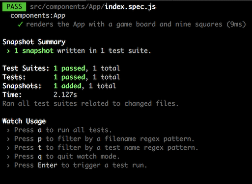
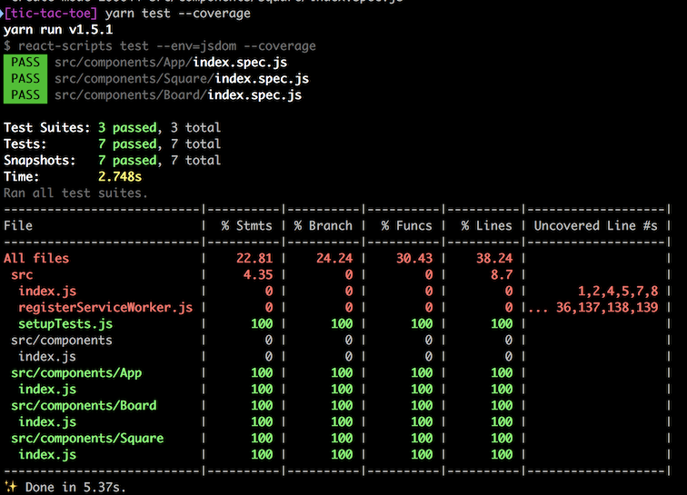
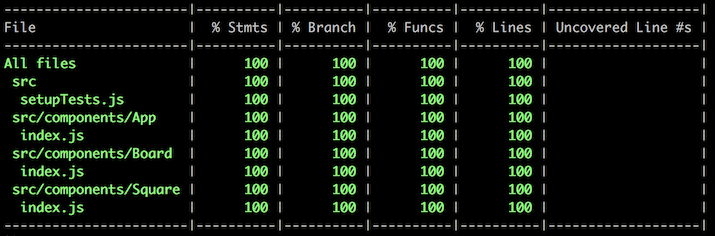

# Adding snapshot tests for our React components

We're going to add tests that take a "snapshot" of our shallowly rendered components. Then each time we run our test suite, we'll shallowly render the component again and check that output against our previous snapshot. This way we are warned when our component's output changes, and we can make sure that the output is what we expected it to be.

`create-react-app` allows us to add our own test setup in a file called `src/setupTests.js`. Whatever we put in that file will be loaded before any tests are run. Think of it as a global configuration for our tests.

Create the file now, and add this code:

```javascript
import Enzyme from 'enzyme'
import Adapter from 'enzyme-adapter-react-16'
import 'jest-enzyme'
import 'jest-styled-components'
import toJson from 'enzyme-to-json'

Enzyme.configure({ adapter: new Adapter() })

global.toJson = toJson
```

First we import Enzyme, which is an AirBnB-created library that helps us to render and test React components. We also need the React version 16 adapter so we can use it with React version 16, which is what we're using to build our game. We can also import all the test "matcher" methods from the `jest-enzyme` library. You'll see these in action later. Then `jest-styled-components` let's us work with `styled-components` in our snapshot tests. Finally, `enzyme-to-json` makes our snapshots prettier and easier to read (for humans, which is what most of us are, probably).

Then we tell Enzyme to use the React 16 Adapter. Finally, we put the `enzyme-to-json` `toJson` function in our `global` object, which is imported into all our test files. That just prevents us from having to import it in every test file.

# First test

Now we'll add our first test. We'll use the extension `spec.js` for all our test files. The `spec` part indicates that we are using a [Behaviour-Driven Development (BDD)](https://en.wikipedia.org/wiki/Behavior-driven_development) style. Don't worry too much about that. The link is for folks who _just have to know_.

So let's create a `src/components/App/index.spec.js` file and add the following code:

```javascript
import React from 'react'
import { shallow } from 'enzyme'

import App from '.'

describe('components:App', () => {
  it('renders the App with a game board and nine squares', () => {
    expect(toJson(shallow(<App />))).toMatchSnapshot()
  })
})
```

The `shallow` renderer will render our React component, but only one leve deep. That means that subcomponents will not be fully rendered. But that's OK because we'll test those components individually. Shallow rendering is fast and makes it easier to debug problems because we know that _they're only one level deep!_

We need to import our App component, of course, and here you can see the benefit of using folders with the component name: our components and their tests (and the `__snapshots__` folder to come) are all neatly contained in one spot.

We will group our tests in `describe` blocks, which are just function calls. The `describe` block takes a string description and a function that will group one or more tests together.

Inside the `describe` block, we add a `test` block. `it` is an alias for `test`. I prefer it because it is more readable (and more of a BDD style). Like the `describe` block, `it` takes a string description of the test and a function that runs the actual test.

In the `it` block we call `shallow(<App />)`, passing it our `<App />` component. That renders the `<App />` component _just one level deep. We pass that to our `toJson` function imported from `enzyme-to-json`, which will pretty it up for us. Then we pass that to our `expect` function, and call the expect's "matcher" method `toMatchSnapshot`. This creates our snapshot if it doesn't exist (and puts it in a `__snapshots__` folder). If a snapshot exists, then it compares the two and either passes if they match, or throws an error if they don't.

Simple, really.

We can run our tests:

```bash
yarn test
```

This will run our tests _in watch mode_. Which means it will stay running (kill it with `q`). Each time we update a file or a test, it will re-run.

The first time we run `yarn test`, we should see this:



Talk a look at the `src/components/App/__snapshots__/index.spec.js.snap` file and you should see this:

```javascript
// Jest Snapshot v1, https://goo.gl/fbAQLP

exports[`components:App renders the App with a game board and nine squares 1`] = `
<StyledApp>
  <Board>
    <Square
      index={0}
      key="0"
      player="x"
    />
    <Square
      index={1}
      key="1"
      player="o"
    />
    <Square
      index={2}
      key="2"
      player="x"
    />
    <Square
      index={3}
      key="3"
      player="o"
    />
    <Square
      index={4}
      key="4"
      player="x"
    />
    <Square
      index={5}
      key="5"
      player="o"
    />
    <Square
      index={6}
      key="6"
      player="x"
    />
    <Square
      index={7}
      key="7"
      player="o"
    />
    <Square
      index={8}
      key="8"
      player="x"
    />
  </Board>
</StyledApp>
`;
```

Pretty easy to read, right? Note that the `Square` components were not further rendered into their `div` elements. That's shallow rendering at work.

Time for a commit:

```bash
git add -A
git commit -m "Add the test configuration and first snapshot test"
git push
```

## Adding the remaining snapshots

### Board

Create `src/components/Board/index.spec.js` and add the following code:

```javascript
import React from 'react'
import { shallow } from 'enzyme'

import Board from '.'

describe('components:Board', () => {
  it('renders the Board with the proper styles', () => {
    expect(toJson(shallow(<Board />))).toMatchSnapshot()
  })
})
```

Then run `yarn test` and let's see what the snapshot looks like. If we check `src/components/Board/__snapshots__/index.spec.js.snap`, we find:

```javascript
// Jest Snapshot v1, https://goo.gl/fbAQLP

exports[`components:Board renders the Board with the proper styles 1`] = `
.c0 {
  -webkit-align-self: center;
  -ms-flex-item-align: center;
  align-self: center;
  display: grid;
  grid-area: board;
  grid-gap: 0;
  grid-template-areas: 'zero one two' 'three four five' 'six seven eight';
  grid-template-columns: 20vh 20vh 20vh;
  grid-template-rows: 20vh 20vh 20vh;
  height: 60vh;
  justify-self: center;
  margin: auto;
  width: 60vh;
}

<div
  className="c0"
/>
`;
```

You can see that `jest-styled-components` has included our CSS styles. Now, when a style changes, so does the snapshot. That's handy, no?

### Square

Let's add the `Square` snapshot test next. In `src/components/Square/index.spec.js` add this code:

```javascript
import React from 'react'
import { shallow } from 'enzyme'

import Square from '.'

describe('components:Square', () => {
  it('renders the Square with the proper styles', () => {
    expect(toJson(shallow(<Square />))).toMatchSnapshot()
  })
})
```

And run the tests with `yarn test`.

Now `src/components/Square/__snapshots__/index.spec.js.snap` looks like this:

```javascript
// Jest Snapshot v1, https://goo.gl/fbAQLP

exports[`components:Square renders the Square with the proper styles 1`] = `<styled.div />`;
```

Not very useful, is it? That's because we've wrapped our StyledDiv in another component. Our shallow render only goes one deep! What can we do?

Let's modify the test to `dive` into that component:

```javascript
import React from 'react'
import { shallow } from 'enzyme'

import Square from '.'

describe('components:Square', () => {
  it('renders the Square with the proper styles', () => {
    expect(toJson(shallow(<Square />).dive())).toMatchSnapshot()
  })
})
```

Run our test again (or did they run automatically?), and _they fail!_

Well, of course they do! We changed the snapshot, right? That's what they're supposed to do. So now let's hit `u` to update the snapshot, and they should pass. Check the `src/components/Square/__snapshots__/index.spec.js.snap` file again and you should see this:

```javascript
// Jest Snapshot v1, https://goo.gl/fbAQLP

exports[`components:Square renders the Square with the proper styles 1`] = `
.c0 {
  border-color: hsla(0,0%,0%,0.2);
  border-style: solid;
  border-width: 0 2px 0 0;
  color: hsla(145,63%,32%,1);
  font-size: 16vh;
  font-weight: bold;
  line-height: 20vh;
  text-align: center;
  text-transform: uppercase;
}

<div
  className="c0"
/>
`;
```

That's more like it. But doesn't our colour change depending on player? Doesn't our border-width vary according to square index? How can we test all these options?

How about more snapshots? Update your `src/components/Square/index.spec.js` file to look like this:

```javascript
import React from 'react'
import { shallow } from 'enzyme'

import Square from '.'

describe('components:Square', () => {
  it('renders the Square with the proper styles for player O in the top left square', () => {
    expect(
      toJson(shallow(<Square player='o' index={0} />).dive())
    ).toMatchSnapshot()
  })

  it('renders the Square with the proper styles for player X in the top left square', () => {
    expect(
      toJson(shallow(<Square player='x' index={0} />).dive())
    ).toMatchSnapshot()
  })

  it('renders the Square with the proper styles for player X in the top right square', () => {
    expect(
      toJson(shallow(<Square player='x' index={2} />).dive())
    ).toMatchSnapshot()
  })

  it('renders the Square with the proper styles for player X in the bottom left square', () => {
    expect(
      toJson(shallow(<Square player='x' index={6} />).dive())
    ).toMatchSnapshot()
  })

  it('renders the Square with the proper styles for player X in the bottom right square', () => {
    expect(
      toJson(shallow(<Square player='x' index={8} />).dive())
    ).toMatchSnapshot()
  })
})
```

Rerun the tests, updating with `u` until they're all passing. Your `src/components/Square/__snapshots__/index.spec.js.snap` should look something like this (note: your order may vary as tests are run in random order):

```javascript
// Jest Snapshot v1, https://goo.gl/fbAQLP

exports[`components:Square renders the Square with the proper styles for player O in the top left square 1`] = `
.c0 {
  border-color: hsla(0,0%,0%,0.2);
  border-style: solid;
  border-width: 0 2px 2px 0;
  color: hsla(145,63%,32%,1);
  font-size: 16vh;
  font-weight: bold;
  line-height: 20vh;
  text-align: center;
  text-transform: uppercase;
}

<div
  className="c0"
>
  o
</div>
`;

exports[`components:Square renders the Square with the proper styles for player X in the bottom left square 1`] = `
.c0 {
  border-color: hsla(0,0%,0%,0.2);
  border-style: solid;
  border-width: 0 2px 0 0;
  color: hsla(6,59%,50%,1);
  font-size: 16vh;
  font-weight: bold;
  line-height: 20vh;
  text-align: center;
  text-transform: uppercase;
}

<div
  className="c0"
>
  x
</div>
`;

exports[`components:Square renders the Square with the proper styles for player X in the bottom right square 1`] = `
.c0 {
  border-color: hsla(0,0%,0%,0.2);
  border-style: solid;
  border-width: 0 0 0 0;
  color: hsla(6,59%,50%,1);
  font-size: 16vh;
  font-weight: bold;
  line-height: 20vh;
  text-align: center;
  text-transform: uppercase;
}

<div
  className="c0"
>
  x
</div>
`;

exports[`components:Square renders the Square with the proper styles for player X in the top left square 1`] = `
.c0 {
  border-color: hsla(0,0%,0%,0.2);
  border-style: solid;
  border-width: 0 2px 2px 0;
  color: hsla(6,59%,50%,1);
  font-size: 16vh;
  font-weight: bold;
  line-height: 20vh;
  text-align: center;
  text-transform: uppercase;
}

<div
  className="c0"
>
  x
</div>
`;

exports[`components:Square renders the Square with the proper styles for player X in the top right square 1`] = `
.c0 {
  border-color: hsla(0,0%,0%,0.2);
  border-style: solid;
  border-width: 0 0 2px 0;
  color: hsla(6,59%,50%,1);
  font-size: 16vh;
  font-weight: bold;
  line-height: 20vh;
  text-align: center;
  text-transform: uppercase;
}

<div
  className="c0"
>
  x
</div>
`;
```

Pay special attention to the content of the `<div>` element, which should be `x` or `o`, and the values for `color` and `border-width`. They should change according to the player and the position of the square, respectively. I think we've got all the possibilities covered here, but if you wanted to be really thorough, you could test all nine squares. I'm OK with this.

## Finishing up

Let's go back to our `App` test and do a `dive()` to make sure our CSS is being tested. In `src/components/App/index.js`:

```javascript
import React from 'react'
import { shallow } from 'enzyme'

import App from '.'

describe('components:App', () => {
  it('renders the App with a game board and nine squares', () => {
    expect(toJson(shallow(<App />).dive())).toMatchSnapshot()
  })
}) 
```

Update the tests with `u` and check the `src/components/App/__snapshots__/index.spec.js.snap` file and you should see:

```javascript
// Jest Snapshot v1, https://goo.gl/fbAQLP

exports[`components:App renders the App with a game board and nine squares 1`] = `
.c0 {
  display: grid;
  font-family: 'Verdana',sans-serif;
  grid-template-areas: 'board';
  height: 100vh;
  margin: 0;
  padding: 0;
  width: 100vw;
}

<div
  className="c0"
>
  <Board>
    <Square
      index={0}
      key="0"
      player="x"
    />
    <Square
      index={1}
      key="1"
      player="o"
    />
    <Square
      index={2}
      key="2"
      player="x"
    />
    <Square
      index={3}
      key="3"
      player="o"
    />
    <Square
      index={4}
      key="4"
      player="x"
    />
    <Square
      index={5}
      key="5"
      player="o"
    />
    <Square
      index={6}
      key="6"
      player="x"
    />
    <Square
      index={7}
      key="7"
      player="o"
    />
    <Square
      index={8}
      key="8"
      player="x"
    />
  </Board>
</div>
`;
```

Looking good. Let's do a commit:

```bash
git add -A
git commit -m "Add remaining snapshot tests"
git push
```

## Test coverage

Jest has a built-in tool (Istanbul) that allows us to check our code to see how thorough our test coverage is. We can run it with the `--coverage` flag thus:

```bash
yarn test --coverage
```

This will run the tests and the coverage tool, then stop. We won't be left in watch mode, in other words.

Here's what our output should look like currently:



As you can see, our `App`, `Board`, and `Square` components are all well tested. Our `index.js` file and the mysterious `registerServiceWorker.js` file, not so much.

But if you check the `src/index.js` file you'll see that it's really kind of all-or-nothing. If everything else works, and the ReactDOM `render` method works, then it should work. So we're not going to bother with testing that file. As for the `src/registerServiceWorker.js` file, we won't test that either. But all that red looks awful, doesn't it? And our `src/components/index.js` file has nothing but imports and exports in it, so that's not much worth testing either.

Let's take them out of the tests entirely. Update your `package.json` file to add these lines:

```json
  "jest": {
    "collectCoverageFrom": [
      "!src/registerServiceWorker.js",
      "!src/index.js",
      "!src/components/index.js",
      "src/**/*.{js,jsx}",
      "!<rootDir>/node_modules/"
    ],
    "snapshotSerializers": [
      "enzyme-to-json/serializer"
    ]
  }
```

The `!` means no or not, so this says that the coverage tool should _ignore_ the `src/registerServiceWorker.js` file, the `src/index.js` file, the `src/components/index.js` file, and the `node_modules` folder, and that it _should_ check all the `js` or `jsx` files in `src` and all its subfolders.

Your full `package.json` file should look like this now:

```json
{
  "name": "tic-tac-toe",
  "version": "0.1.0",
  "private": true,
  "dependencies": {
    "ramda": "^0.25.0",
    "ramda-adjunct": "^2.6.0",
    "react": "^16.3.1",
    "react-dom": "^16.3.1",
    "react-redux": "^5.0.7",
    "react-router": "^4.2.0",
    "react-scripts": "1.1.4",
    "redux": "^3.7.2",
    "redux-observable": "^0.18.0",
    "rxjs": "^5.5.10",
    "styled-components": "^3.2.5"
  },
  "scripts": {
    "start": "react-scripts start",
    "build": "react-scripts build",
    "test": "react-scripts test --env=jsdom",
    "format": "prettier-standard 'src/**/*js'",
    "precommit": "lint-staged",
    "eject": "react-scripts eject"
  },
  "lint-staged": {
    "linters": {
      "src/**/*.js": [
        "prettier-standard",
        "git add"
      ]
    }
  },
  "devDependencies": {
    "enzyme": "^3.3.0",
    "enzyme-adapter-react-16": "^1.1.1",
    "enzyme-to-json": "^3.3.3",
    "husky": "^0.14.3",
    "jest-enzyme": "^6.0.0",
    "jest-styled-components": "^5.0.1",
    "lint-staged": "^7.0.4",
    "prettier-standard": "^8.0.1",
    "react-test-renderer": "^16.3.1"
  },
  "jest": {
    "collectCoverageFrom": [
      "!src/registerServiceWorker.js",
      "!src/index.js",
      "!src/components/index.js",
      "src/**/*.{js,jsx}",
      "!<rootDir>/node_modules/"
    ],
    "snapshotSerializers": [
      "enzyme-to-json/serializer"
    ]
  }
}
```

Let's save that and re-run `yarn test --coverage`:



OK, we're good to go on tests for the moment. Let's do another commit:

```bash
git add -A
git commit -m "Update the test coverage configuration"
git push
```
