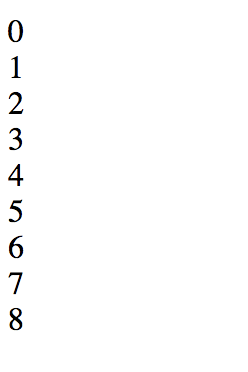
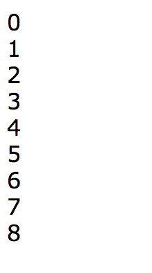
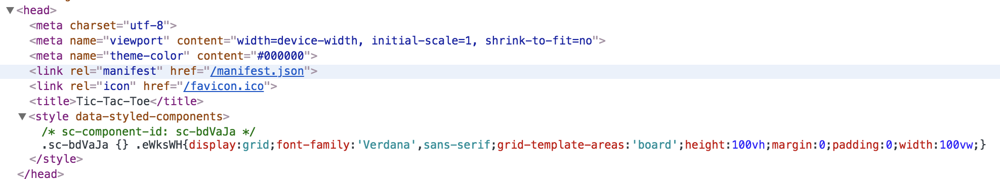
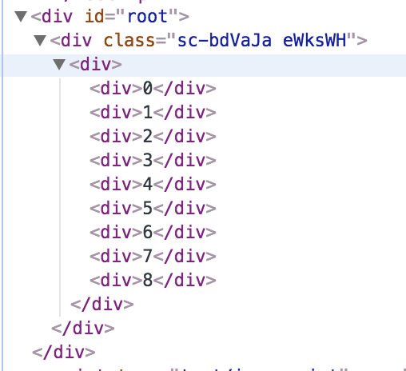
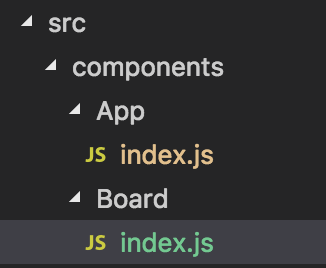
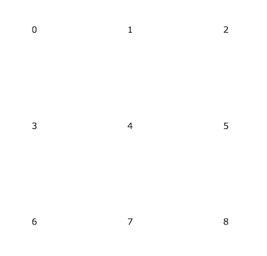

# Adding the game board

The first thing we'll do is to set up a game board. In this step, we're just going to create a visual board. We won't worry about updating the board, tracking players, or anything else. We'll just make a nice-looking tic-tac-toe board.

To do this, we're going to use [styled-components](https://www.styled-components.com/). The `styled-components` library makes it easy for us to create React components that carry their own CSS style with them. When the application is built, the `styled-components` library will automatically extract the CSS from each component, wrap it in a unique CSS class, and inject it into a stylesheet in the head of the HTML document, just like a regular CSS stylesheet. What's more, it will add that unique class name to the React component.

For more information on how this works and the whys, check out [this video by MaxStoiber](https://www.youtube.com/watch?v=bIK2NwoK9xk), the inventor of `styled-components`.

But first, let's just create a basic board. Currently, our `src/components/App/index.js` file looks like this:

```javascript
import React from 'react'

export default function App () {
  return <h1>Tic-Tac-Toe</h1>
}
```

We'll replace the current output with a simple board made up of `div` elements. Make your `src/components/App/index.js` file look like this:

```javascript
import React from 'react'

export default function App () {
  return (
    <div>
      <div>
        <div>0</div>
        <div>1</div>
        <div>2</div>
        <div>3</div>
        <div>4</div>
        <div>5</div>
        <div>6</div>
        <div>7</div>
        <div>8</div>
      </div>
    </div>
  )
}
```

The outermost div will be our App, the first nested div will be our Board, and the nine divs nested in that one will be our nine Squares.

Save your changes and run `yarn start` then point your browser to [http://localhost:3000/](http://localhost:3000/) to see the changes. You should see something like thes:



Doesn't look much like a tic-tac-toe board, does it. But don't worry, we'll fix that shortly. Notice that we've numbered the squares starting with zero. That's because were going to use a JavaScript array to keep track of our board's squares, and JavaScript array indices begin with 0.

Before we move on, let's do a commit:

```bash
git add -A
git commit -m "Add first pass at game board"
git push
```

## Thinking in React

React is all about building reusable components. Think of them as our own, bespoke HTML elements. What kind of components would we want here? Well, we have a game board that consists of nine squares, each of which can hold either an X or an O. So it's seems reasonable that our `App` component would hold a `Board` component, and that our `Board` components would hold nine instances of a `Square` component.

We'll start at the top. Let's begin by styling our `App` component. To do this, we'll create a `StyledApp` component with `styled-components` and we'll use that in our `App` component.

First, we'll need to import the `styled-component` library at the top of our `src/components/App/index.js` file. Then we'll create a `StyledApp` component by using the `styled.div` method and passing it a [template string](https://developer.mozilla.org/en-US/docs/Web/JavaScript/Reference/Template_literals#Multi-line_strings). This utilises a new feature of JavaScript called [tagged templates](https://developer.mozilla.org/en-US/docs/Web/JavaScript/Reference/Template_literals#Tagged_templates).

```javascript
import React from 'react'
import styled from 'styled-components'

const StyledApp = styled.div`
  display: grid;
  font-family: 'Verdana', sans-serif;
  grid-template-areas: 'board';
  height: 100vh;
  margin: 0;
  padding: 0;
  width: 100vw;
`

export default function App () {
  return (
    <StyledApp>
      <div>
        <div>0</div>
        <div>1</div>
        <div>2</div>
        <div>3</div>
        <div>4</div>
        <div>5</div>
        <div>6</div>
        <div>7</div>
        <div>8</div>
      </div>
    </StyledApp>
  )
}
```

If you check the browser, you should see this:



Not much has changed (yet), but you can see that the font family has changed to Verdana (compare with the earlier screenshot), so our styles are being applied.

We can also verify this by looking in the Chrome Devtools (or the equivalent in whatever browser you're using). If we look in the `<head>` element, we can see that the stylesheet has been extracted and injected into a `<style>` element, and that the class has a unique name:



And if we look in the body, we can see that this unique class has been applied to our App's `<div>` element:



Sweet! Now let's create our Board component.

First, we'll create a new folder under `src/components`. Call it `Board` and add an `index.js` file in it. We'll follow this pattern of naming the folder with the component name (in [PascalCase]()), and using `index.js` for the file name (`index.js` files are loaded by default, so we can still use `import Board from './components/Board'` to import the Board component). You're folder/file hierarchy should look like this when you're done:



Then in the `src/components/Board/index.js` file, add the following:

```javascript
import styled from 'styled-components'

const Board = styled.div`
  align-self: center;
  display: grid;
  grid-area: board;
  grid-gap: 0;
  grid-template-areas: 'zero one two' 'three four five' 'six seven eight';
  grid-template-columns: 20vh 20vh 20vh;
  grid-template-rows: 20vh 20vh 20vh;
  height: 60vh;
  justify-self: center;
  margin: auto;
  width: 60vh;
`

export default Board
```

This is not a class in CSS, so we won't explain all the CSS we're using here. If you're interested, you can simply read more about [CSS Grid Layout]().

Some things to note:

* We aren't using any [JSX](https://reactjs.org/docs/jsx-in-depth.html), so we don't need to import React (JSX is the JavaScript that looks like HTML in our files).
* We create a styled `<div />` component by calling the `div` function from the `styled` library _and passing it a template string. Template strings are multi-line strings delimited by the back tick (```) character.
* We're using CSS Grid Layout to create a grid with three rows of three cells each. These cells will be our Squares.
* We call the squares 'zero', 'one', 'two', etc., which corresponds to the square's index in an array (JavaScript array indices start at 0).
* Each row is `20vh` units high, and each column is `20vh` units wide. A `vh` unit is 1% of the height of the window, so each square will have height and width equal to 20% of the height of the window area.
* The gap between the squares is set to 0 pixels.

Let's add our `Board` export to our `src/components/index.js` file so that we can import it easily:

```javascript
import App from './App'
import Board from './Board'

export { App, Board }
```

And now let's import it into our `src/components/App/index.js` file so that we can use it:

```javascript
import React from 'react'
import styled from 'styled-components'

import { Board } from '../'

const StyledApp = styled.div`
  display: grid;
  font-family: 'Verdana', sans-serif;
  grid-template-areas: 'board';
  height: 100vh;
  margin: 0;
  padding: 0;
  width: 100vw;
`

export default function App () {
  return (
    <StyledApp>
      <Board>
        <div>0</div>
        <div>1</div>
        <div>2</div>
        <div>3</div>
        <div>4</div>
        <div>5</div>
        <div>6</div>
        <div>7</div>
        <div>8</div>
      </Board>
    </StyledApp>
  )
}
```

Run `yarn start` and see what it looks like. (Or, if you've never bothered to shut the server down using `Control-c`, you can just check your browser and it should have updated automatically.) You should see something like this:



Time for another commit:

```bash
git add -A
git commit -m "Add CSS grid board with styled-components"
git push
```

### Now for the Squares

OK, let's add our Square component now. First, create a `src/components/Square` folder and a `src/components/Square/index.js` file in it. Then add this code:

```javascript
import React from 'react'
import styled from 'styled-components'

const StyledSquare = styled.div`
  border-color: hsla(0, 0%, 0%, 0.2);
  border-style: solid;
  border-width: 2px;
  color: gray;
  font-size: 16vh;
  font-weight: bold;
  line-height: 20vh;
  text-align: center;
  text-transform: uppercase;
`

export default function Square (props) {
  return (
    <StyledSquare index={props.index} player={props.player}>
      {props.player}
    </StyledSquare>
  )
}
```

Here we've imported React because we're using JSX. Our `Square` component uses the `StyledSquare` component. This is so that we can pass the player in as a prop, and also pass it in as the "children" of the `StyledSquare`. That will add it to our div as a text element (the innerHTML of our div).

Let's see it in action and we'll see how it works, then we'll extend it a little.

First, add it to `src/components/index.js`:

```javascript
import App from './App'
import Board from './Board'
import Square from './Square'

export { App, Board, Square }
```
.
Then we'll use it in our `src/components/App/index.js` file. We'll add in some temporary fake plays, too.

```javascript
import React from 'react'
import styled from 'styled-components'

import { Board, Square } from '../'

const StyledApp = styled.div`
  display: grid;
  font-family: 'Verdana', sans-serif;
  grid-template-areas: 'board';
  height: 100vh;
  margin: 0;
  padding: 0;
  width: 100vw;
`

export default function App () {
  return (
    <StyledApp>
      <Board>
        <Square index={0} player='x' />
        <Square index={1} player='o' />
        <Square index={2} player='x' />
        <Square index={3} player='o' />
        <Square index={4} player='x' />
        <Square index={5} player='o' />
        <Square index={6} player='x' />
        <Square index={7} player='o' />
        <Square index={8} player='x' />
      </Board>
    </StyledApp>
  )
}
```

We're getting closer! Here's what you should see now:


Let's do a commit:

```bash
git add -A
git commit -m "First pass at board squares"
git push
```

## Adding polish

OK, that doesn't look like a normal tic-tac-toe board, which looks a little like a # sign. We need to get rid of a few borders.

Fortunately, we can change our styled components based on the props we're passing in. Take a look at this line in our `src/components/Square/index.js` file:

```javascript
border-width: 2px;
```

We only want _some_ borders to be this width, and the rest we want to be 0px wide, right?

Can we make our board using only `border-bottom` and `border-right`? Let's think about it. Which squares would need a `border-bottom`? It would be the top six, right? Those are cells 0-5 in our array. In other words, every square in the board with an index less than 6 should have a bottom border of 2px. We could make a function to take the index and return the correct border width like this:

```javascript
index => index < 6 ? '2px' : 0
```

That is an arrow function expression that represents a function that takes one parameter, which we'll call `index` here, then compares that index with 6, and if it is less than 6, it return the value right after the `?`, which is '2px'. If it is not less than six, it returns the value right after the `:`, which is 0. This is called a ternary operator because it has three parts: the condition, the value returned when the condition is true, and the value returned when the condition is false, in that order.

Our `styled.div` function accepts a props object, and we can provide functions on those props to use in our tagged template.

What about the right borders? A look at our numbered game board above shows us that we'd want the borders on our first two columns, which means squares 0, 3, and 6, and squares 1, 4, and 7, but not on squares 2, 5, and 8. What do these numbers have in common? The trick is to think about the repetition in our board. We have rows of three squares, so every three squares we repeat. So 3 is an important number.

If we divide the indexes of the squares in the first column by 3, we get 0 remainder (0, 3, and 6 all divide evenly by 3). If we divide the indexes of the squares in the second column by 3, we get a remainder of 1, and if we do the same with the third column, we get a remainder of 2. So we _don't_ want to add right borders to those squares that have a remainder of 2 when their indexes are divided by 3:

```javascript
index => index % 3 === 2 ? 0 : '2px'
```

Here, `%` is the remainder operator. This function takes a parameter (call it `index`), and if it has a remainder of 2 when divided by 3, it returns 0, otherwise it returns '2px'.

Let's put these in our code in `src/components/Square/index.js`, remembering that the order for border properties is top, right, bottom, left:

```javascript
import React from 'react'
import styled from 'styled-components'

const StyledSquare = styled.div`
  border-color: hsla(0, 0%, 0%, 0.2);
  border-style: solid;
  border-width: 0
    ${props => (props.index % 3 === 2 ? 0 : '2px')}
    ${props => (props.index < 6 ? '2px' : 0)}
    0;
  color: gray;
  font-size: 16vh;
  font-weight: bold;
  line-height: 20vh;
  text-align: center;
  text-transform: uppercase;
`

export default function Square (props) {
  return (
    <StyledSquare index={props.index} player={props.player}>
      {props.player}
    </StyledSquare>
  )
}
```

Check the browser, and we should see this:


It worked! But the colours kind of suck. Let's use a red for the X values, and a green for the O values. Chistmassy, right?

As we're also passing the `player` into the Square, we can use that prop to set the color:

```javascript
import React from 'react'
import styled from 'styled-components'

const StyledSquare = styled.div`
  border-color: hsla(0, 0%, 0%, 0.2);
  border-style: solid;
  border-width: 0
    ${props => (props.index % 3 === 2 ? 0 : '2px')}
    ${props => (props.index < 6 ? '2px' : 0)}
    0;
  color: ${props => (props.player === 'x' ? 'hsla(6, 59%, 50%, 1)' : 'hsla(145, 63%, 32%, 1)')};
  font-size: 16vh;
  font-weight: bold;
  line-height: 20vh;
  text-align: center;
  text-transform: uppercase;
`

export default function Square (props) {
  return (
    <StyledSquare index={props.index} player={props.player}>
      {props.player}
    </StyledSquare>
  )
}
```

And we have colours!


Good time to do a commit:

```bash
git add -A
git commit -m "Improve the board squares"
git push
```
