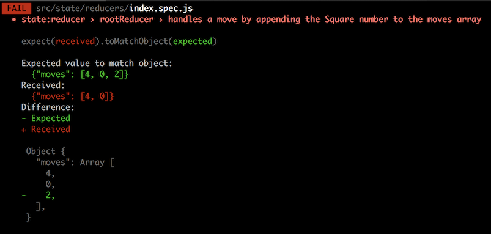
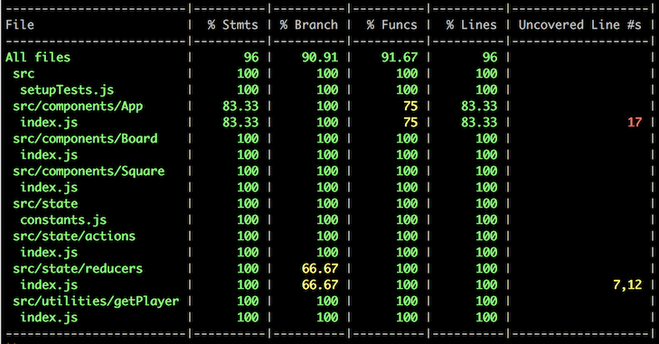

# Adding state management with Redux

We now have click handlers on our Squares, but all they do is log out the number of the Square to the dev console. That's not much use.

What we want is to track the players' moves in a `moves` array. We need somewhere to store that. We could store it in the internal state of the `App` component&mdash;and that's how most developers would probably do it initially&mdash;but, really, we will find it much easier in the long run to store all our state in one place, not distributed throughout the app.

A great way to do this is with the [redux](https://redux.js.org/) library.

Let's build a store in which we can keep our `moves` array. Then we'll pass that store into our `App` component (using React's [context](https://reactjs.org/docs/context.html) feature). In our `App` component we'll add a "selector" that gets the current state of our `moves` array, and a method that "dispatches" an action to the store that will append a move onto the `moves` array. It may seem complex, but it's actually very simple.

To begin, we'll create an action that represents a player's move. We're going to use a JavaScript Object with a `type` key and a `payload` key, and in the payload we'll include the square that the player is playing. Here is what our 'SQUARE_CLICKED' action is going to look like:

```javascript
{
  type: 'SQUARE_CLICKED',
  payload: {
    square: 4
  }
}
```

This is the current practice for Redux actions: a `type`, a `payload`, and, if necessary, a `meta` key.

We'll have a very limited, _enumerated_ set of action types, so let's create constants for the type names. First, let's create a folder to hold our state management code under the `src` folder and call it `src/state`. Then in there, let's create a `src/state/constants.js` file and a `src/state/index.js` file. Add the following to the `constants.js` file:

```javascript
export const SQUARE_CLICKED = 'SQUARE_CLICKED'
```

Pretty simple file, eh? Now we'll do our regular import/export in the `src/state/index.js` file:

```javascript
import { SQUARE_CLICKED } from './constants'

export { SQUARE_CLICKED }
```

And we'll add this file to our list of files the coverage tool should ignore in `package.json`:

```json
"collectCoverageFrom": [
  "!src/registerServiceWorker.js",
  "!src/index.js",
  "!src/components/index.js",
  "!src/state/index.js",
  "!src/utilities/index.js",
  "src/**/*.{js,jsx}",
  "!<rootDir>/node_modules/"
],
```

Now we can use that action type to create our action. We're going to make an action creator function for our `squareClicked` action. Create a new folder under `src/state` at `src/state/actions` and an `index.spec.js` file in that folder. Now we'll add our test:

```javascript
import { squareClicked } from '.'
import { SQUARE_CLICKED } from '..'

describe('state:actions', () => {
  describe('squareClicked', () => {
    it('produces the correct action for clicking a Square', () => {
      const square = 4

      expect(squareClicked(square)).toMatchObject({
        type: SQUARE_CLICKED,
        payload: {
          square: 4
        }
      })
    })
  })
})
```

Run the tests (use `p` and `actions` to filter on the actions folder) and you should see it fail. Now let's make it pass. Create a `src/state/actions/index.js` file with the following code:

```javascript
import { SQUARE_CLICKED } from '..'

function squareClicked (square) {
  return {
    type: SQUARE_CLICKED,
    payload: {
      square
    }
  }
}

export { squareClicked }
```

By now it should be obvious how this works. And the test should be passing. Let's add that to our `src/state/index.js` file:

```javascript
import { squareClicked } from './actions'
import { SQUARE_CLICKED } from './constants'

export { SQUARE_CLICKED, squareClicked }
```
  
We have a working action creator! Let's commit to it:

```bash
git add -A
git commit -m "Add squareClicked action creator"
git push
```

-----

## The reducer

Next we need a function that will accept that action and our current state object and return a new state with that square added to the `moves` array. For this purpose, we'll use a Redux "reducer" function. Reducers are simple: they take an action and a state, and return a new state. Hey! Just what we were looking for.

So create a `src/state/reducers` folder, and an `index.spec.js` file in it. And then write this test:

```javascript
import { rootReducer } from '.'

describe('state:reducers', () => {
  describe('rootReducer', () => {
    it('handles an unknown action type by returning the state unchanged', () => {
      const state = 'state'

      expect(rootReducer(state, {})).toBe(state)
    })
  })
})
```

You may have noticed that the tests in watch mode only run on files chagned since the last commit, so we don't really need to filter them. Run the tests with `yarn test` and you should see the reducers test fail. Now we need to make it pass. So create a `src/state/reducers/index.js` file and add the following:

```javascript
function rootReducer (state, action) {
  switch (action && action.type) {
    default:
      return state
  }
}

export { rootReducer }
```

Ha, ha. This couldn't be much simpler! It takes a state and an action, switches on the action.type (if it exists), and then does only one default action: returns the state unchanged. Not much use, but enough to pass our simple test. That's one of our requirements handled. Now let's address the other: we want to add squares to the moves array. Leave the tests running while we add more.

Let's create a new test first. Here's our updated `src/state/reducers/index.spec.js`:

```javascript
import { rootReducer } from '.'
import { squareClicked } from '..'

describe('state:reducer', () => {
  describe('rootReducer', () => {
    it('handles an unknown action type by returning the state unchanged', () => {
      const state = 'state'

      expect(rootReducer(state, {})).toBe(state)
    })

    it('handles a move by appending the Square number to the moves array', () => {
      const state = {
        moves: [4, 0]
      }

      expect(rootReducer(state, squareClicked(2))).toMatchObject({
        moves: [4, 0, 2]
      })
    })
  })
})
```

That's going to fail something like this:



As you can see, it did what we'd expect: returned the state unchanged. So let's fix that. Here is our new `src/state/reducer/index.js` file:

```javascript
import { isUndefined } from 'ramda-adjunct'

import { SQUARE_CLICKED } from '..'

const initialState = { moves: [] }

function rootReducer (state = initialState, { payload = {}, type }) {
  switch (type) {
    case SQUARE_CLICKED:
      return {
        ...state,
        moves: isUndefined(payload.square)
          ? state.moves
          : [...state.moves, payload.square]
      }
    default:
      return state
  }
}

export { initialState, rootReducer }
```

Here we:

* Import `isUndefined` from 'ramda-adjunct'
* Create an initial state that holds an empty `moves` array
* Default the state parameter to the `initialState`
* Destructure the `action` parameter into a payload (defaults to an empty object) and a type
* Handle a SQUARE_CLICKED action type by creating a new state and
  * Copying over the old state: `...state` (this uses the new [spread operator](https://developer.mozilla.org/en-US/docs/Web/JavaScript/Reference/Operators/Spread_syntax))
  * Overwriting the `moves` array
    * If the `payload.square` is undefined, then just keeping the same `moves`
    * If the `payload.square` _is_ defined, then appending it to the `moves` array and returning that

Our test passes with flying colours, so we now have a `moves` array in state that updates.

Now let's update `src/state/index.js`:

```javascript
import { squareClicked } from './actions'
import { SQUARE_CLICKED } from './constants'
import { initialState, rootReducer } from './reducers'

export { initialState, rootReducer, SQUARE_CLICKED, squareClicked }
```

See the pattern emerging?

So let's run our coverage tests again just for fun: `yarn test --coverage`. Here's what we should see:



Pay no attention to the App line&mdash;we'll fix that later (it's because we're not finished there). But what's going on with our reducer? We have two uncovered lines: 7 and 12.

Here is line 7:

```javascript
function rootReducer (state = initialState, { payload = {}, type }) {
```

We've tested the reducer with and without a payload, so that can't be it. But have we tested that the state defaults to the `initialState`? No, we haven't. So let's add a test for that. We'll need to import the initialState, too. Here's our updated `src/state/reducers/index.spec.js`:

```javascript
import { initialState, rootReducer } from '.'
import { squareClicked } from '..'

describe('state:reducers', () => {
  describe('rootReducer', () => {
    it('defaults to the initialState', () => {
      expect(rootReducer(undefined, {})).toBe(initialState)
    })

    it('handles an unknown action type by returning the state unchanged', () => {
      const state = 'state'

      expect(rootReducer(state, {})).toBe(state)
    })

    it('handles a move by appending the Square number to the moves array', () => {
      const state = {
        moves: [4, 0]
      }

      expect(rootReducer(state, squareClicked(2))).toMatchObject({
        moves: [4, 0, 2]
      })
    })
  })
})
```

Run our coverage check and line 7 has been handled. Now for line 12. It looks like this:

```javascript
moves: isUndefined(payload.square)
  ? state.moves
  : [...state.moves, payload.square]
```

We need to add a test that passes the action, but without a square. Here's our new `src/state/reducers/index.spec.js` file. The new test is at the bottom:

```javascript
import { initialState, rootReducer } from '.'
import { squareClicked } from '..'

describe('state:reducers', () => {
  describe('rootReducer', () => {
    it('defaults to the initialState', () => {
      expect(rootReducer(undefined, {})).toBe(initialState)
    })

    it('handles an unknown action type by returning the state unchanged', () => {
      const state = 'state'

      expect(rootReducer(state, {})).toBe(state)
    })

    it('handles a move by appending the Square number to the moves array', () => {
      const state = {
        moves: [4, 0]
      }

      expect(rootReducer(state, squareClicked(2))).toMatchObject({
        moves: [4, 0, 2]
      })
    })

    it('returns the state unchanged when the square is not supplied', () => {
      const state = {
        moves: [4, 0]
      }

      expect(rootReducer(state, squareClicked())).toMatchObject({
        moves: [4, 0]
      })
    })
  })
})
```

Run the coverage again and the reducer is at 100% coverage.

OK, time for another commit:

```bash
git add -A
git commit -m "Add rootReducer to handle squareClicked actions"
git push
```

-----

## Getting our moves out of the state

We also want to be able to retrieve our moves array from the state. We'll make a "selector" to do this. This selector will be absurdly simple, but as our app grows, our selectors will grow more complex, and it will become evident why they are useful.

Create a `src/state/selectors` folder and a `src/state/selectors/index.spec.js` file in it. Then add our test to the `index.spec.js` file:

```javascript
import { getMoves } from '.'

describe('state:selectors', () => {
  describe('getMoves', () => {
    it('extracts the moves array from the state', () => {
      const moves = [4, 0, 2]
      const state = { moves }

      expect(getMoves(state)).toBe(moves)
    })
  })
})
```

This fails the test. Now let's add the code in `src/state/selectors/index.js` to make it pass:

```javascript
export function getMoves ({ moves }) {
  return moves
}
```

Finally, let's update our `src/state/index.js` file to import and export our selectors:

```javascript
import { squareClicked } from './actions'
import { SQUARE_CLICKED } from './constants'
import { initialState, rootReducer } from './reducers'
import { getMoves } from './selectors'

export { getMoves, initialState, rootReducer, SQUARE_CLICKED, squareClicked }
```

Tough one, eh? And the tests pass and coverage is 100%. Let's commit!

```bash
git add -A
git commit -m "Add getMoves selector"
git push
```
