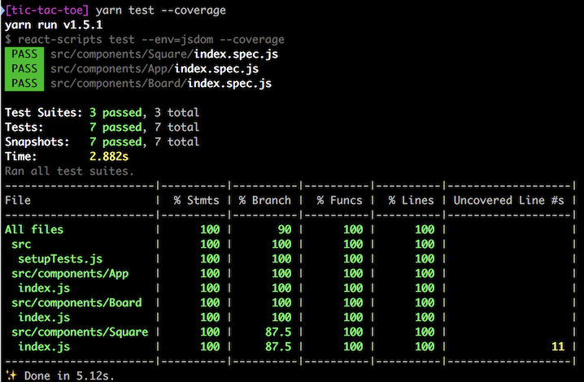
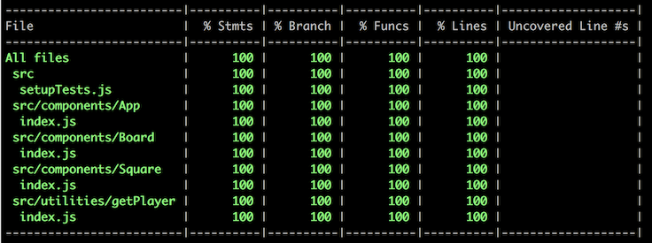
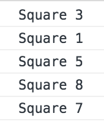

# Making the board interactive

Our next move (pun intended) is to make the board interactive. We want to be able to click on a square and have an X or an O appear&mdash;but only when we click on an empty square.

How do we know which player is clicking? Is it an X or an O? Well, for our minimum viable product (MVP), we're going to keep it simple by making a rule: X moves first. This means that move zero&mdash;remember that our `moves` will be stored in a JavaScript Array, and that in JavaScript, Array indices start at zero&mdash;will be X.

Move one will be O, move two will be X, move three will be O, etc. And by now you should be seeing a nice benefit of this rule. Can you guess it?

It is this: all of the even-numbered moves are X moves; all of the odd-numbered moves are O moves.

So let's say that we have a moves array like this: `[4, 0, 2]`. We know that X moved first to the center square (4), then O took the upper left square (0), and then X took the upper right square (2). That's a lot of information packed into a simple array. We know the players, we know who moved when (the order), and we know which squares were involved.

And from this array we can figure out the player on each square, right? If we suggest that the player is determined by `move % 2 == 0 ? 'x' : 'o'`, then we can see that the moves to squares 4 and 2 are X moves (0 and 2 are evenly divided by 2), and the move to square 0 is O (1 leaves a remainder of 1 when divided by 2).

But first, let's add a click handler to our square. We'll pass it in as a prop, so it's pretty simple. Here's our updated `src/components/Square/index.js` file:

```javascript
import React from 'react'
import styled from 'styled-components'

const StyledSquare = styled.div`
  border-color: hsla(0, 0%, 0%, 0.2);
  border-style: solid;
  border-width: 0 ${({ index }) => (index % 3 === 2 ? 0 : '2px')}
    ${({ index }) => (index < 6 ? '2px' : 0)} 0;
  color: ${({ player }) => (player === 'x' ? 'hsla(6, 59%, 50%, 1)' : 'hsla(145, 63%, 32%, 1)')};
  font-size: 16vh;
  font-weight: bold;
  line-height: 20vh;
  text-align: center;
  text-transform: uppercase;
`

export default function Square ({ handleClick, index, player }) {
  return (
    <StyledSquare index={index} player={player} onClick={handleClick}>
      {player}
    </StyledSquare>
  )
}
```

Now all we have to do is pass the `handleClick` function to our `<Square />` components (which will do in our `App` component) and we're good to go.

One thing, though. I would be nice if the cursor over the square turned into a "pointer" (the kind you see when you mouse over a link) when the click handler was present. The `handleClick` function gets passed to the `onClick` prop of the `StyledSquare` component (so it will be called on click!), so we can see it as an `onClick` prop in `StyledSquare`. Now we can change the cursor based on whether the click handler is attached or not:

```javascript
import React from 'react'
import styled from 'styled-components'
import { isUndefined } from 'ramda-adjunct'

const StyledSquare = styled.div`
  border-color: hsla(0, 0%, 0%, 0.2);
  border-style: solid;
  border-width: 0 ${({ index }) => (index % 3 === 2 ? 0 : '2px')}
    ${({ index }) => (index < 6 ? '2px' : 0)} 0;
  color: ${({ player }) =>
    player === 'x' ? 'hsla(6, 59%, 50%, 1)' : 'hsla(145, 63%, 32%, 1)'};
  cursor: ${({ onClick }) => (isUndefined(onClick) ? 'default' : 'pointer')}
  font-size: 16vh;
  font-weight: bold;
  line-height: 20vh;
  text-align: center;
  text-transform: uppercase;
`

export default function Square ({ handleClick, index, player }) {
  return (
    <StyledSquare index={index} player={player} onClick={handleClick}>
      {player}
    </StyledSquare>
  )
}
```

If we run our tests now, we'll see that several snapshots fail. Well of course they do. We changed the CSS to add a `cursor` property. We'll need to regenerate them by hitting `u` for "update".

So now we should have five snapshots passing, but if we look at them we'll see a problem. I'll make it easy for you. Just run `yarn test --coverage`. Here's what you should see:



Whoa! What happened here? Looks like our `Square` coverage is missing a branch (87.5% coverage) and the problem is on line 11, which looks like this:

```javascript
cursor: ${({ onClick }) => (isUndefined(onClick) ? 'default' : 'pointer')}
```

No surprise there. That's the line we added. And if you look at the snapshot itself, you'll see that every example sets the cursor to 'default'. We need one that sets it to 'pointer'. So let's update our `src/components/Square/index.spec.js` file to this:

```javascript
import React from 'react'
import { shallow } from 'enzyme'

import Square from '.'

describe('components:Square', () => {
  it('renders the Square with the proper cursor if a click handler is provided', () => {
    expect(
      toJson(shallow(<Square handleClick={() => null} index={0} />).dive())
    ).toMatchSnapshot()
  })

  it('renders the Square with the proper styles for player O in the top left square', () => {
    expect(
      toJson(shallow(<Square player='o' index={0} />).dive())
    ).toMatchSnapshot()
  })

  it('renders the Square with the proper styles for player X in the top left square', () => {
    expect(
      toJson(shallow(<Square player='x' index={0} />).dive())
    ).toMatchSnapshot()
  })

  it('renders the Square with the proper styles for player X in the top right square', () => {
    expect(
      toJson(shallow(<Square player='x' index={2} />).dive())
    ).toMatchSnapshot()
  })

  it('renders the Square with the proper styles for player X in the bottom left square', () => {
    expect(
      toJson(shallow(<Square player='x' index={6} />).dive())
    ).toMatchSnapshot()
  })

  it('renders the Square with the proper styles for player X in the bottom right square', () => {
    expect(
      toJson(shallow(<Square player='x' index={8} />).dive())
    ).toMatchSnapshot()
  })
})
```

We added a test (at the top to make it easier to see) that passes in a very simple function. That should get us a snapshot with the cursor set to 'pointer'. Run `yarn test --coverage`. You should be back at 100% coverage. Then check the `src/components/Square/__shapshots__/index.spec.js.snap` file. There should be a snapshot like this:

```javascript
exports[`components:Square renders the Square with the proper cursor if a click handler is provided 1`] = `
.c0 {
  border-color: hsla(0,0%,0%,0.2);
  border-style: solid;
  border-width: 0 2px 2px 0;
  color: hsla(145,63%,32%,1);
  cursor: pointer;
  font-size: 16vh;
  font-weight: bold;
  line-height: 20vh;
  text-align: center;
  text-transform: uppercase;
}

<div
  className="c0"
  onClick={[Function]}
/>
`;
```

Notice that the cursor is set to 'pointer'.

Time for a commit:

```bash
git add -A
git commit -m "Add click handling to the Squares"
git push
```

## Adding a getPlayer utility function

We want to add our click handler to any Square that hasn't already been played, and if it has been played, then we want to set the player instead. So we're going to need to know whether a square has been played and, by the way, who played it, X or O.

We talked earlier about having a `moves` array that might look like this: `[4, 0, 2]`. We'll write a `getPlayer` function that takes the current Square index and the moves array, determines if there has been a move in this Square, and if there has, returns the player's mark. If there hasn't been a move yet in that square, we'll return `undefined`.

Let's start by creating a `src/utilties` folder, and inside that a `src/utilities/getPlayer` folder, and inside that an `index.spec.js` file. That's right, we're going to write the tests first. So in the `src/utilities/getPlayer/index.spec.js` file, add:

```javascript
import getPlayer from '.'

describe('utilities:getPlayer', () => {
  it('returns undefined if moves array not provided', () => {
    expect(getPlayer(4)).toBeUndefined()
  })

  it('returns `x` for even-numbered moves', () => {
    expect(getPlayer(4, [4, 0])).toBe('x')
  })

  it('returns `o` for odd-numbered moves', () => {
    expect(getPlayer(0, [4, 0])).toBe('o')
  })

  it('returns undefined for empty squares (not moved yet)', () => {
    expect(getPlayer(3, [4, 0])).toBeUndefined()
  })
})
```

It should be pretty obvious what these tests do, and that they've covered most of our bases, if not all of them. Take the first one: "utilities:getPlayer returns undefined if moves array not provided". Then we have `getPlayer(4)`, which includes the Square's index (the move), but not the array of moves. And we `expect` the return from that function call `toBeUndefined`. Reads like English.

Let's run the tests, but only on this file. Begin with our normal `yarn test`, but once the test harness starts up, hit `p` to filter by file name, type `getPlayer` at the prompt, and hit Enter. It should now run only the tests in the `src/utilities/getPlayer/index.spec.js` file, and you should see all four fail.

Now we'll write the code to make them pass. This style of test-driven development (TDD) is similar to [red-green refactor](http://blog.cleancoder.com/uncle-bob/2014/12/17/TheCyclesOfTDD.html), except we don't have time to be quite as granular as we should be. But you can always write the tests and the code one line at a time.

Here's a first pass at our `getPlayer` utility function. Put it in `src/utilities/getPlayer/index.js`.

```javascript
import { indexOf } from 'ramda'

export default function getPlayer (square, moves = []) {
  const move = indexOf(square, moves)

  if (move < 0) {
    return undefined
  }

  return move % 2 === 0 ? 'x' : 'o'
}
```

The Ramda `indexOf` function gives us the index of an item in an array, or -1 if the item is not in the array. [Try it](http://ramdajs.com/repl/#?const%20arr%20%3D%20%5B%27a%27%2C%20%27b%27%2C%20%27c%27%5D%0A%0Aconsole.log%28indexOf%28%27a%27%2C%20arr%29%29%0Aconsole.log%28indexOf%28%27b%27%2C%20arr%29%29%0Aconsole.log%28indexOf%28%27c%27%2C%20arr%29%29%0Aconsole.log%28indexOf%28%27d%27%2C%20arr%29%29%0A).

We then check if `indexOf(square, moves)` returned a -1, meaning there is no move in that square, and if so, return `undefined`.

Finally, if we haven't already returned `undefined`, then we check whether the move is odd or even, and return 'o' or 'x' accordingly.

Run the tests on `getPlayer` again, and they should all pass.

Keeping our utility functions small and simple makes testing and debugging much easier. This function has a variable assignment, a guard (in case there is no move), and a result, which depends on a simple ternary operator.

Let's add a `src/utilities/index.js` file that imports and re-exports utility functions. Add this code:

```javascript
import getPlayer from './getPlayer'

export { getPlayer }
```

And we don't need to include this in our test coverage, so we'll add that to our `package.json` file:

```json
"collectCoverageFrom": [
  "!src/registerServiceWorker.js",
  "!src/index.js",
  "!src/components/index.js",
  "!src/utilities/index.js",
  "src/**/*.{js,jsx}",
  "!<rootDir>/node_modules/"
],
```

Now if we run `yarn test --coverage`, we should see:



So we have a `getPlayer` function. What next?

A commit:

```bash
git add -A
git commit -m "Add the getPlayer utility function"
git push
```

And then . . .

## Adding the click handler _or_ player to the Squares

Let's update our `src/components/App/index.js` file to use `getPlayer` and, on the basis of what it returns:

* Provide a click handler to the Square if the player is `undefined` (we'll use a stubbed function for the moment)
* Set the player to 'x' or 'y', respectively, if the player is defined

We can do this in our `makeSquares` function. First we'll import our `getPlayer` function: `import { getPlayer } from '../../utilities'`. Then we'll update our function (and use a named function in the process):

```javascript
import React from 'react'
import styled from 'styled-components'
import { times } from 'ramda'
import { isUndefined } from 'ramda-adjunct'

import { Board, Square } from '..'
import { getPlayer } from '../../utilities'

function makeSquares (moves) {
  return times(square => {
    const player = getPlayer(square, moves)

    return isUndefined(player)
      ? <Square
        key={square}
        index={square}
        handleClick={() => console.log(`Square ${square}`)}
        />
      : <Square key={square} index={square} player={player} />
  }, 9)
}

const StyledApp = styled.div`
  display: grid;
  font-family: 'Verdana', sans-serif;
  grid-template-areas: 'board';
  height: 100vh;
  margin: 0;
  padding: 0;
  width: 100vw;
`

export default function App ({ moves = [4, 0, 2] /* mock */ }) {
  return (
    <StyledApp>
      <Board>{makeSquares(moves)}</Board>
    </StyledApp>
  )
}
```

Things to note:

* We imported the `isUndefined` function from 'ramda-adjunct'
* We imported the `getPlayer` utility function from '../../utilities'
* Our `makeSquares` function has grown considerably, but all the changes are in the anonymous function we pass to the `times` method
  * That function used to look like this: `idx => <Square key={idx} index={idx} player={idx % 2 === 0 ? 'x' : 'o'} />`
  * Now we've renamed `idx` to be `square`, which is clearer
  * We're also passing in the `moves` array in the call to `makeSquares` (we'll need it below in the anonymous function)
  * Once we have the player, we check if it is `undefined`
    * If it's undefined, we return a `Square` with a mock `handleClick` function that just logs out the square number to console
    * If the player is defined, then we pass that to the `Square` in the `player` prop
* We're passing in a hard-coded `moves` array in our call to `makeSquares`: this is only temporary so we can see if it works

This is our new output. Note that the Squares that have been played have the correct players, and are not clickable. But click on a few empty squares and take a look in the developer console. You should see something like this:



Let's add a new snapshot to cover this new situation where some squares are played. First, let's remove our mock `moves` array from `src/components/App/index.js`:

```javascript
export default function App ({ moves = [] }) {
  return (
    <StyledApp>
      <Board>{makeSquares(moves)}</Board>
    </StyledApp>
  )
}
```

Then, in `src/components/App/index.spec.js`, put:

```javascript
import React from 'react'
import { shallow } from 'enzyme'

import App from '.'

describe('components:App', () => {
  it('renders the App with a blank game board and nine squares', () => {
    expect(toJson(shallow(<App />).dive())).toMatchSnapshot()
  })

  it('renders the App with a game board three moves: center, top-left, top-right', () => {
    expect(toJson(shallow(<App moves={[4, 0, 2]} />).dive())).toMatchSnapshot()
  })
})
```

Run the tests with `yarn test`, then hit `u` to update the snapshots. Then take a look in `src/components/App/__snapshots/index.spec.js.snap` and you should see something like this:

```javascript
// Jest Snapshot v1, https://goo.gl/fbAQLP

exports[`components:App renders the App with a blank game board and nine squares 1`] = `
.c0 {
  display: grid;
  font-family: 'Verdana',sans-serif;
  grid-template-areas: 'board';
  height: 100vh;
  margin: 0;
  padding: 0;
  width: 100vw;
}

<div
  className="c0"
>
  <styled.div>
    <Square
      handleClick={[Function]}
      index={0}
      key="0"
    />
    <Square
      handleClick={[Function]}
      index={1}
      key="1"
    />
    <Square
      handleClick={[Function]}
      index={2}
      key="2"
    />
    <Square
      handleClick={[Function]}
      index={3}
      key="3"
    />
    <Square
      handleClick={[Function]}
      index={4}
      key="4"
    />
    <Square
      handleClick={[Function]}
      index={5}
      key="5"
    />
    <Square
      handleClick={[Function]}
      index={6}
      key="6"
    />
    <Square
      handleClick={[Function]}
      index={7}
      key="7"
    />
    <Square
      handleClick={[Function]}
      index={8}
      key="8"
    />
  </styled.div>
</div>
`;

exports[`components:App renders the App with a game board three moves: center, top-left, top-right 1`] = `
.c0 {
  display: grid;
  font-family: 'Verdana',sans-serif;
  grid-template-areas: 'board';
  height: 100vh;
  margin: 0;
  padding: 0;
  width: 100vw;
}

<div
  className="c0"
>
  <styled.div>
    <Square
      index={0}
      key="0"
      player="o"
    />
    <Square
      handleClick={[Function]}
      index={1}
      key="1"
    />
    <Square
      index={2}
      key="2"
      player="x"
    />
    <Square
      handleClick={[Function]}
      index={3}
      key="3"
    />
    <Square
      index={4}
      key="4"
      player="x"
    />
    <Square
      handleClick={[Function]}
      index={5}
      key="5"
    />
    <Square
      handleClick={[Function]}
      index={6}
      key="6"
    />
    <Square
      handleClick={[Function]}
      index={7}
      key="7"
    />
    <Square
      handleClick={[Function]}
      index={8}
      key="8"
    />
  </styled.div>
</div>
`;
```

You should see one board that's empty (every Square has a `handleClick` function), and another in which three squares are played (`player` set to 'x' or 'o', no `handleClick` function).

That's enough for this time. We'll add state next. Meanwhile, let's do a commit:

```bash
git add -A
git commit -m "Add click handler to squares, update snapshots"
git push
```
