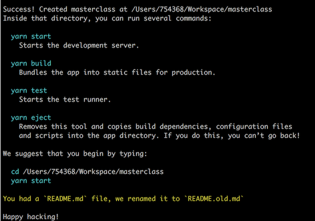
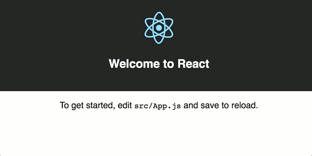
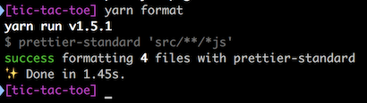
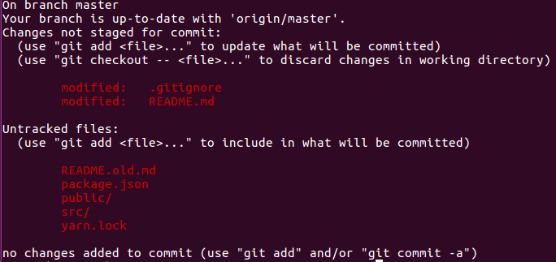
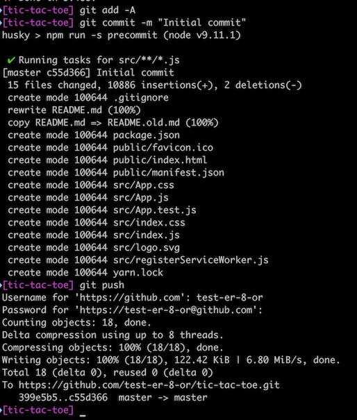
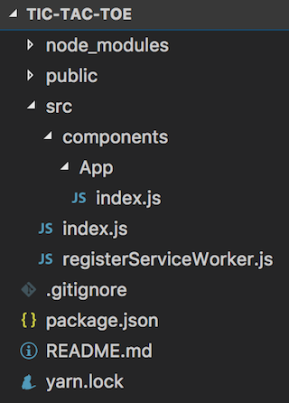
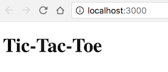
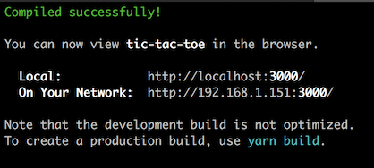
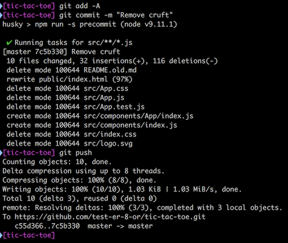

# Setup

**If you are attending a Summer of Tech class that will use this tutorial, then please install the following software and complete this step _before_ attending the class.**

We will not have time to work with you individually or to wait while you install software during the class&mdash;especially if many people are attempting to download simultaneously. If you really can't get everything installed&mdash;even after searching for help online&mdash;then please contact us through Summer of Tech and we'll try to help.

**For the best masterclass experience**, take the time to get everything installed correctly and make sure it's running properly. We're, like, serious about this.

For the rest of you, you're on your own. Heh, heh.

**Note:** If you don't want to set everything up on your own laptop, or if your laptop is a bit old, or you'd just rather work online, then you can follow [these instructions for using CodeSandbox.io](./code-sandbox-README.md). We recommend signing in with a GitHub account (and registering with GitHub if you don't already have one).

If you have access to a Mac (or a Linux laptop), you'll find this process much easier. But if you must use Windows, you'll find plenty of help online, so don't despair. Windows, especially Windows 10, has made working with Node much easier.

That said, our demo will be performed with a Mac.

**Very important note**: If you diverge from these instructions in any way and get stuck, we _may_ not be able to help you. There are too many things that could go wrong. So please, the first time through, follow instructions to the letter as much as possible. On a second or third time through (and we recommend you try this several times, digging deeper each time until it all becomes clear to you), you can start experimenting. But first time through, _by the book, please_.

## Node

First and foremost, you must have [node.js](https://nodejs.org/en/) installed. We run the Current version so it is best if you do too. (That is, don't install the LTS version unless you have to.)

## Yarn

Once you have node.js installed, install [yarn](https://yarnpkg.com/en/docs/install). We'll be using yarn throughout the demo, so it will make it easier for you. However, if you're stuck on **npm**, then you're welcome to use it instead. But why not give Yarn a try? Kittens like it! Can't be all bad.

## An IDE or code editor

You'll need some way to write and edit code. We'll be using [Visual Studio Code](https://code.visualstudio.com/), the most popular code editor, and we highly recommend that you do, too, unless you are already very comfortable with another editor (e.g, Atom, Sublime Text). An IDE is really overkill for what we have planned, but if you can't live without one, then that's OK, too.

Note: you don't have to uninstall or give up your favourite editor to use VSCode for this class. They can coexist peacefully!

We'll be using a few extensions for VSCode during the class. We recommend that you install them, too. There are typically equivalents available for other code editors/IDEs if you're sticking with some other editor. Do a search.

## Access to a terminal (console)

If you're using Linux, you're probably very familiar with the terminal and the command line. If you're on a Mac, you can find it in the Applications > Utilities folder, but we recommend installing the wonderful [iTerm2](https://iterm2.com/). If you're on Windows, things get a bit trickier. We recommend [hyper](https://hyper.is/) from the wonderful folks at [Zeit](https://zeit.co/). We'll explain all the commands you'll need, so no worries there.

You could also use the console built in to VSCode (or your preferred IDE/editor). But whatever you use, _make sure you have a working console_ (you can't complete these instructions without one).

## ESLint

We'll be using ESLint to check our code syntax. Wikipedia defines linter or lint thus: _tools that analyse source code to flag programming errors, bugs, stylistic errors, and suspicious constructs_. ESLint will help you to write better code.

VSCode has an [ESLint extension](https://marketplace.visualstudio.com/items?itemName=dbaeumer.vscode-eslint), as do most code editors. Go ahead and install this now.

## Prettier

We'll also be using a code formatter to format our code to [JavaScript Standard Style](https://standardjs.com/). This keeps our code style consistent across files and applications and makes it easier for others to read and understand our code.

VSCode has a [Prettier-standard extension](https://marketplace.visualstudio.com/items?itemName=numso.prettier-standard-vscode). You can find similar extensions for other editors as well. If you're using VSCode, install this now.

**You can get by without the linter and formatter**, but you'll probably be much happier with them. Just sayin'.

## Babel JavaScript

We're going to be using the hottest, newest JavaScript code to write our application, because, hey, we rock! We want our editor to highlight our syntax properly. We'll be using the Babel "transpiler" (don't ask) to convert our super-hot, ultra-modern code back to the stone age code used by most browsers. (Only slightly joking there.) So let's add an extension to make it easier to read that modern ES.next code: [Babel Javascript](https://marketplace.visualstudio.com/items?itemName=mgmcdermott.vscode-language-babel).

## Git and GitHub

You can skip this step if you just want to work locally on your own computer, but if you want us to look at your code, you'll need to put a copy online. The best way to do this (and to provide for [version control](https://en.wikipedia.org/wiki/Version_control) of your code) is with Git and GitHub. As you can see if you're reading this, that's what we use.

To use [Git](https://git-scm.com/), you'll need to install it locally. Then sign up for a [GitHub](https://github.com/join) account if you don't already have one. Then click "Start a Project", verify your email address, and sign in.

Next, go to your profile and click on the "Repositories" tab, then click the bright green "New" button.

Give your repository a name such as `tic-tac-toe`. Add a description, maybe "Tic-Tac-Toe game"? Just a suggestion.

Then check "Initialize this repository with a README". Under ".gitignore" select "Node". You can choose a license if you want to. Finally, click the green "Create repository" button.

Now you have a Git repository on GitHub! Donc professionnel!

We'll want to "clone" a copy of your repository to your local computer so you can use it. So click the "Clone or Download" button, then click the clipboard (icon) button to copy the URL to the clipboard. It's easier to use clone with HTTPS so make sure this is selected. 

You have a terminal app, right? (See above.) Open it and in a folder somewhere (we use a folder called Workspace in our home folder to organise our work), clone the repository with:

```bash
git clone <paste-your-copied-url-here> && cd $_
```

That will clone your repository and change your working directory (`cd`) to the root folder of your repository. If you type `ls` (list) and hit Enter you should see your README file. If you've installed VSCode, you can now type `code .` and Enter to open this folder in Visual Studio Code. If you're using another editor or IDE, open your project folder in that.

## Create-react-app

In our masterclass, we'll be using Facebook's [create-react-app](https://git-scm.com/) to create a basic React application instantly. It's magic! Then we'll modify that code to create a two-player Tic-Tac-Toe game. Fun, eh?

You'll be using the command line for this installation (and to build your Tic-Tac-Toe app), so open your terminal/console.

If you installed Yarn successfully, you can use it to install `create-react-app`:

```bash
yarn global add create-react-app
```

If you insist on sticking with `npm`, then use this:

```bash
npm i -g create-react-app
```

That installs `create-react-app` globally, so you can use it from the command line. Now let's create a scaffold for our Tic-Tac-Toe app.

Did you create a Git repository and `cd` into the root folder above? If so, we'll use the current folder name (`.`) as the name of our app:

```bash
create-react-app .
```

Make sure your working directory is your Git repo root folder before you type that or your day will suddenly go suddenly very wrong.

If you're not using Git, then you'll need to create the folder at the same time, then `cd` into it. We can do that like this:

```bash
create-react-app tic-tac-toe && cd $_
```

This will take a while. Make sure you're online because `create-react-app` will be downloading many dependencies from node. Hum a favourite song while you wait for it to finish its business.

Once that process is complete, you should be able to see a host of files in your code editor. And you'll see something like this in your terminal:



Now you can follow the instructions and use

```bash
yarn start
```

To start your new React app up. It should open the default home page in your browser at `http://localhost:3000/`. Here's what you can expect:



Très chic, non?

In your terminal, hold the Control key down and hit the C key to stop your application.

## Makin' it pretty

`create-react-app` comes with ESLint already installed and configured. But we still need to install and configure `prettier-standard` if we're going to take advantage of automatic code formatting.

From within your project root folder, type the following in the terminal:

```bash
yarn add -D prettier-standard
```

Whistle a happy tune while the process completes. (Or not, if whistling is not your thing.)

Got it installed? OK, we'll need to add a script to our application to permit us to run the `prettier-standard` formatter from the command line. We'll do this in the `package.json` file, which is where we configure our application. So open `package.json` in your editor and add a line for a `format` command like this:

```json
  "scripts": {
    "start": "react-scripts start",
    "build": "react-scripts build",
    "test": "react-scripts test --env=jsdom",
    "format": "prettier-standard 'src/**/*.js'",
    "eject": "react-scripts eject"
  }
```

Save the changes to `package.json`. Now we can run our `prettier-standard` formatter any time we want from the command line. To test it, open `src/App.js` in your code editor. It should look like this:

```javascript
import React, { Component } from 'react';
import logo from './logo.svg';
import './App.css';

class App extends Component {
  render() {
    return (
      <div className="App">
        <header className="App-header">
          
          <h1 className="App-title">Welcome to React</h1>
        </header>
        <p className="App-intro">
          To get started, edit <code>src/App.js</code> and save to reload.
        </p>
      </div>
    );
  }
}

export default App;
```

We're now going to run `prettier-standard` to reformat all our code to JavaScript Standard Style. You won't see a big change, but one obvious one is that JSS does not use semicolons, so all the semicolons at the ends of lines should disappear.

In the terminal, type the following and hit Enter:

```bash
yarn format
```

The output should look like this:



And if you check your `src/App.js` file now, it should look like this:

```javascript
import React, { Component } from 'react'
import logo from './logo.svg'
import './App.css'

class App extends Component {
  render () {
    return (
      <div className='App'>
        <header className='App-header'>
          
          <h1 className='App-title'>Welcome to React</h1>
        </header>
        <p className='App-intro'>
          To get started, edit <code>src/App.js</code> and save to reload.
        </p>
      </div>
    )
  }
}

export default App
```

Yeah! We don't need no semicolons! (Apologies to lovers of semicolons.)

If you're using Git and GitHub, then we can set prettier to run every time we commit changes to our repository. This is optional! But it's nice, too.

We'll use [`lint-staged`](https://github.com/okonet/lint-staged) and [`husky`](https://github.com/typicode/husky) to run `prettier-standard` and stage the changes every time we do a commit&mdash;before the commit runs. (If you're not familiar with Git and version control and don't know what a [commit](https://git-scm.com/docs/git-commit) is, don't worry. We'll cover that in the class.)

First, we'll install our dependencies with yarn:

```bash
yarn add -D lint-staged
yarn add -D husky --force
```

Note: the `--force` flag is necessary to force husky to work properly with yarn. Without it, the git hooks do not install properly. The `-D` flag installs these dependencies for "development" mode only&mdash;we won't need them in production.

A Git "hook" is a way to "hook" into a git command and run some code either before or after the command runs. In this instance, we're going to hook into the `git commit` command and a) run `prettier-standard` to clean up our code, then b) run `git add` to stage any changes so they'll be included in the commit. Then we'll let the `git commit` go forward.

We do this in our `package.json` file, which is where we configure and control our application. So open that file in your code editor and add the "precommit" line:

```json
  "scripts": {
    "start": "react-scripts start",
    "build": "react-scripts build",
    "test": "react-scripts test --env=jsdom",
    "format": "prettier-standard 'src/**/*js'",
    "precommit": "lint-staged",
    "eject": "react-scripts eject"
  },
```

This tells `husky` to listen for the `git commit` command and run `lint-staged` _before_ ("pre") the commit.

Now we'll configure `lint-staged` to tell it what commands to run before each commit. In the same `package.json` file, add this below the scripts:

```json
  "scripts": {
    "start": "react-scripts start",
    "build": "react-scripts build",
    "test": "react-scripts test --env=jsdom",
    "format": "prettier-standard 'src/**/*js'",
    "precommit": "lint-staged",
    "eject": "react-scripts eject"
  },
  "lint-staged": {
    "linters": {
      "src/**/*.js": [
        "prettier-standard",
        "git add"
      ]
    }
  }
```

This tells `lint-staged` to run the following commands on all files below the `src` folder: First, `prettier-standard`, which does the same thing that our `yarn format` command did, namely, cleans up all the code in the `src` folder.

Then `lint-staged` will run `git add`, which "stages" the modified files so they'll be included in the commit. After that, the commit runs as usual.

In this manner we can automatically clean up our source code each and every time we commit changes to our repository. If you're not using a Git repository, skip this step, and just try to remember to run `yarn format` regularly before you deploy your code.

And if you have all this working, then you're more than ready for our masterclass. Can't wait to see you there!

If anything is not working, check the code in this repository (particularly the `package.json` file) and compare it to your own. It should look like this:

```json
{
  "name": "tic-tac-toe",
  "version": "0.1.0",
  "private": true,
  "dependencies": {
    "react": "^16.3.1",
    "react-dom": "^16.3.1",
    "react-scripts": "1.1.4"
  },
  "scripts": {
    "start": "react-scripts start",
    "build": "react-scripts build",
    "test": "react-scripts test --env=jsdom",
    "format": "prettier-standard 'src/**/*js'",
    "precommit": "lint-staged",
    "eject": "react-scripts eject"
  },
  "lint-staged": {
    "linters": {
      "src/**/*.js": [
        "prettier-standard",
        "git add"
      ]
    }
  },
  "devDependencies": {
    "husky": "^0.14.3",
    "lint-staged": "^7.0.4",
    "prettier-standard": "^8.0.1"
  }
}
```

## Committing our changes

If you're using Git and GitHub, then there's one last step. Let's "commit" our changes and push them up to GitHub.

First let's see what files have been created or altered:
```bash
git status
``` 

You should see a list of the files similar to:



Next, you'll "stage" all the changes. That tells git to include them in the commit. You have to stage your changes before you can commit them:

```bash
git add -A
```

You can run ```git status``` again to see the files are now green, meaning they are staged and ready to commit.

Then we'll commit them with a simple commit message:

```bash
git commit -m "Initial commit"
```

Finally, we can push our changes up to GitHub:

```bash
git push
```

You should see something like this:



If you go to your repository on GitHub and reload the page, you should see all your changes. Nifty, eh?

# Cleaning up the cruft

There's one more thing we can do to get ready for the masterclass. Facebook's `create-react-app` is nice, but it adds a lot of cruft that we don't need. For example, the animated logo.

Let's delete the files we don't need, and clean up the ones that remain, simplifying our code.

In the `src` folder, delete the following files:

* App.css
* App.test.js
* index.css
* logo.svg
* README.old.md

Create a new folder called `components` in the `src` folder, then create an `App` folder inside the `components` folder, and, finally, move the `App.js` file into the `src/components/App` folder and rename it to `index.js`.

Your folder and file structure should now look like this:



Now let's update the files to remove the code we no longer need and simplify the code that remains. Don't worry if none of this makes sense to you. All will be made clear in the masterclass! (OK, clearer.)

In the `src/components/App/index.js` file, make it look like this:

```javascript
import React from 'react'

export default function App () {
  return <h1>Tic-Tac-Toe</h1>
}
```

Whoa! That's a lot simpler. No?

Now add a file `index.js` in the `src/components` folder and make it look like this:

```javascript
import App from './App'

export { App }
```

Then update the `src/index.js` file (are you seeing a pattern with filenames here?) to look like this:

```javascript
import React from 'react'
import { render } from 'react-dom'

import { App } from './components'
import registerServiceWorker from './registerServiceWorker'

render(<App />, document.getElementById('root'))
registerServiceWorker()
```

Finally, look in the `public` folder for the `index.html` file and clean it up so that it looks like this (don't miss the change from "shortcut icon" to "icon"):

```html
<!DOCTYPE html>
<html lang="en">

<head>
  <meta charset="utf-8">
  <meta name="viewport" content="width=device-width, initial-scale=1, shrink-to-fit=no">
  <meta name="theme-color" content="#000000">
  <link rel="manifest" href="%PUBLIC_URL%/manifest.json">
  <link rel="icon" href="%PUBLIC_URL%/favicon.ico">
  <title>Tic-Tac-Toe</title>
</head>

<body>
  <noscript>
    You need to enable JavaScript to run this app.
  </noscript>
  <div id="root"></div>
</body>

</html>
```

Let's test that it still works by running `yarn start` in the project's root folder (in our console, of course). The app should start and open itself in the browser. You should see this in your browser:



And this in your console (terminal):



If everything appears to be working, then use Control-C to stop the app. If not, recheck your code against the code in this repo to see where you've gone wrong.

Once everything is working, we can do another commit and push:

```bash
git add -A
git commit -m "Remove cruft"
git push
```

It will look like this in the terminal:



Check your code on GitHub by reloading the page and you should see all the latest changes there.

# Adding a couple of utilities

We'll be using a very functional style of coding and the latest best practices for our Tic-Tac-Toe app. Why not? So we're going to add a few libraries that we'll need later. Let's do it now.

At the command line (and with your project root folder as the working directory), type the following and hit the Enter key:

```bash
yarn add ramda ramda-adjunct styled-components react-router redux react-redux redux-observable rxjs rxjs-compat redux-devtools-extension
yarn add -D enzyme enzyme-adapter-react-16 enzyme-to-json jest-enzyme jest-styled-components react-test-renderer redux-mock-store
```

That should install those libraries. Then we'll do another commit and push:

```bash
git add -A
git commit -m "Add ramda, ramda-adjunct, styled-components"
git push
```

Your final `package.json` file should look like this (version numbers may vary):

```json
{
  "name": "tic-tac-toe",
  "version": "0.1.0",
  "private": true,
  "dependencies": {
    "ramda": "^0.25.0",
    "ramda-adjunct": "^2.6.0",
    "react": "^16.3.1",
    "react-dom": "^16.3.1",
    "react-redux": "^5.0.7",
    "react-router": "^4.2.0",
    "react-scripts": "1.1.4",
    "redux": "^3.7.2",
    "redux-devtools-extension": "^2.13.2",
    "redux-observable": "^0.18.0",
    "rxjs": "^5.5.10",
    "styled-components": "^3.2.5"
  },
  "scripts": {
    "start": "react-scripts start",
    "build": "react-scripts build",
    "test": "react-scripts test --env=jsdom",
    "format": "prettier-standard 'src/**/*js'",
    "precommit": "lint-staged",
    "eject": "react-scripts eject"
  },
  "lint-staged": {
    "linters": {
      "src/**/*.js": [
        "prettier-standard",
        "git add"
      ]
    }
  },
  "devDependencies": {
    "enzyme": "^3.3.0",
    "enzyme-adapter-react-16": "^1.1.1",
    "enzyme-to-json": "^3.3.3",
    "husky": "^0.14.3",
    "jest-enzyme": "^6.0.0",
    "jest-styled-components": "^5.0.1",
    "lint-staged": "^7.0.4",
    "prettier-standard": "^8.0.1",
    "react-test-renderer": "^16.3.1",
    "redux-mock-store": "^1.5.1"
  }
}
```

Congratulations! You're ready to rock and roll with React and Tic-Tac-Toe. See you at the Summer of Tech 2018 Masterclass.

You can also get a head start by reading up on these utilities:

## [ramda](http://ramdajs.com/)

Ramda gives us a host of powerful functions for manipulating data. The [Ramda docs](http://ramdajs.com/docs/) can take a little getting used to, but the examples help a lot. And the [Ramda REPL](http://ramdajs.com/repl/) is a great place to play around with Ramda. You can [bookmark your code](http://ramdajs.com/repl/?v=0.25.0#?const%20colours%20%3D%20%5B%27red%27%2C%20%27yellow%27%2C%20%27green%27%2C%20%27cyan%27%2C%20%27blue%27%2C%20%27magenta%27%5D%0A%0Aconst%20fourLetter%20%3D%20filter%28pipe%28length%2C%20equals%284%29%29%29%0A%0AfourLetter%28colours%29) and come right back to it later or send the link to a friend.

## [ramda-adjunct](https://char0n.github.io/ramda-adjunct/)

Ramda-adjunct adds a wealth of useful functions to Ramda so we don't have to rewrite them ourselves.

## [styled-components](https://www.styled-components.com/)

Makes it easy for us to encapsulate our CSS styles in our components, and theme them as well.

You might also consider watching this [talk about styled-components](https://www.youtube.com/watch?v=bIK2NwoK9xk).

## [react-router](https://reacttraining.com/react-router/)

"React Router is a collection of navigational components that compose declaratively with your application."

## [redux](https://redux.js.org/)

Redux is a predictable state container for JavaScript apps.

## [react-redux](https://github.com/reactjs/react-redux)

The React bindings for Redux. (Makes Redux and React work together easily.)

For the curious, [a video on react-redux by Dan Abramov](https://www.youtube.com/watch?v=VJ38wSFbM3A)

## [redux-observable](https://redux-observable.js.org/)

"RxJS 5-based middleware for Redux. Compose and cancel async actions to create side effects and more."

## [rxjs](http://reactivex.io/rxjs/) [rxjs-compat](https://www.npmjs.com/package/rxjs-compat)

(Note: If you are running the latest Rx.js and node, you may not need the rxjs-compat library.)

"RxJS is a library for reactive programming using Observables, to make it easier to compose asynchronous or callback-based code."

## [enzyme](http://airbnb.io/enzyme/)

"Enzyme is a JavaScript Testing utility for React that makes it easier to assert, manipulate, and traverse your React Components' output."

## [enzyme-adapter-react-16](https://github.com/airbnb/enzyme/tree/master/packages/enzyme-adapter-react-16)

Just something Enzyme needs to work with React version 16. Don't worry about it.

## [enzyme-to-json](https://github.com/adriantoine/enzyme-to-json)

Makes our Enzyme snapshots prettier. You'll see.

## [jest-enzyme](https://github.com/FormidableLabs/enzyme-matchers)

Makes Enzyme work better with [Jest](https://facebook.github.io/jest/), which is what we'll be using for our tests.

## [jest-styled-components](https://github.com/styled-components/jest-styled-components)

Jest utilities for working with Styled Components

## [react-test-renderer](https://reactjs.org/docs/test-renderer.html)

Allows us to "render" our React components for testing without having to have a browser. Much faster.

## [redux-mock-store](http://arnaudbenard.com/redux-mock-store/)

"A mock store for your testing your redux async action creators and middleware."

## [redux-devtools-extension](https://github.com/zalmoxisus/redux-devtools-extension)

The coolest thing ever for tracking your application state. Time travelling!
